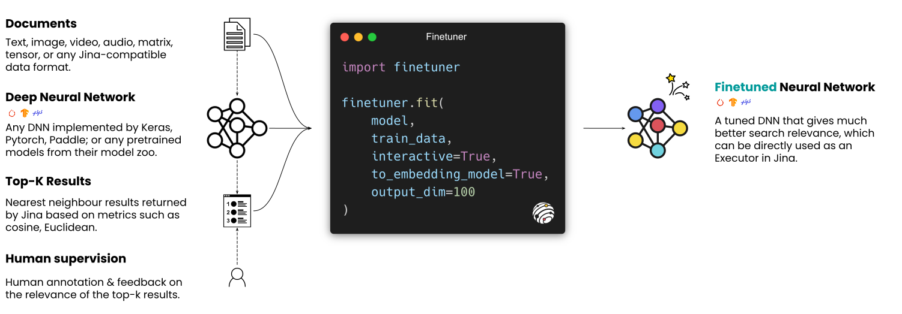

<p align="center">

</p>


<p align="center">
<b>Finetuning any deep neural network for better embedding on neural search tasks</b>
</p>

<p align=center>
<a href="https://pypi.org/project/finetuner/"></a>
<a href="https://pypi.org/project/finetuner/"></a>
<a href="https://slack.jina.ai"></a>
</p>

<!-- start elevator-pitch -->

Finetuner allows one to tune the weights of any deep neural network for better embedding on search tasks. It
accompanies [Jina](https://github.com/jina-ai/jina) to deliver the last mile of performance-tuning for neural search
applications.

🎛 **Designed for finetuning**: a machine learning-powered human-in-the-loop tool for leveling up your pretrained models in neural search applications.

🔱 **Powerful yet intuitive**: all you need is `finetuner.fit()` - a one-liner that unlocks rich features such as
siamese/triplet network, interactive labeling, layer trimming, weights freezing, dimensionality reduction.

⚛️ **Framework-agnostic**: promise an identical API experience on [Pytorch](https://pytorch.org/)
, [Keras](https://keras.io/) or [PaddlePaddle](https://github.com/PaddlePaddle/Paddle) deep learning backends.

🧈 **Jina integration**: buttery smooth integration with Jina, reducing the cost of context-switch between experimenting
and production.

<!-- end elevator-pitch -->

## How does it work




## Install

Make sure you have Python 3.7+ and one of Pytorch, Keras or PaddlePaddle installed on Linux/MacOS.

```bash
pip install finetuner
```

## [Documentation](https://finetuner.jina.ai)

## Usage

<table>
<thead>
  <tr>
    <th colspan="2" rowspan="2">🪄 Usage</th>
    <th colspan="2">Do you have an embedding model?</th>
  </tr>
  <tr>
    <th>Yes</th>
    <th>No</th>
  </tr>
</thead>
<tbody>
  <tr>
    <td rowspan="2"><b>Do you have labeled data?</b></td>
    <td><b>Yes</b></td>
    <td align="center">1️⃣</td>
    <td align="center">3️⃣</td>
  </tr>
  <tr>
    <td><b>No</b></td>
    <td align="center">2️⃣</td>
    <td align="center">4️⃣</td>
  </tr>
</tbody>
</table>

### 1️⃣ Have embedding model and labeled data

Perfect! Now `embed_model` and `labeled_data` are given by you already, simply do:

```python
import finetuner

finetuner.fit(
    embed_model,
    train_data=labeled_data
)
```

### 2️⃣ Have embedding model and unlabeled data

You have an `embed_model` to use, but no labeled data for finetuning this model. No worry, that's good enough already!
You can use Finetuner to interactive label data and train `embed_model` as below:

```python
import finetuner

finetuner.fit(
    embed_model,
    train_data=unlabeled_data,
    interactive=True
)
```

### 3️⃣ Have general model and labeled data

You have a `general_model` which does not output embeddings. Luckily you provide some `labeled_data` for training. No
worry, Finetuner can convert your model into an embedding model and train it via:

```python
import finetuner

finetuner.fit(
    general_model,
    train_data=labeled_data,
    to_embedding_model=True,
    output_dim=100
)
```

### 4️⃣ Have general model and unlabeled data

You have a `general_model` which is not for embeddings. Meanwhile, you don't have labeled data for training. But no
worries, Finetuner can help you train an embedding model with interactive labeling on-the-fly:

```python
import finetuner

finetuner.fit(
    general_model,
    train_data=unlabeled_data,
    interactive=True,
    to_embedding_model=True,
    output_dim=100
)
```
