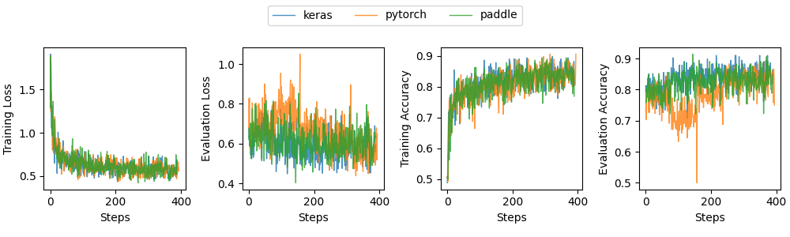
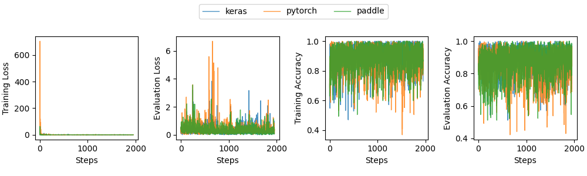
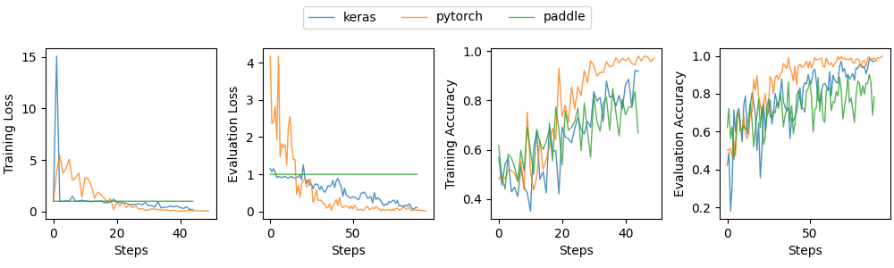

<p align="center">

</p>


<p align="center">
<b>Finetuning any deep neural network for better embedding on neural search tasks</b>
</p>


## [Documentation](https://finetuner.jina.ai)


--- 

# Legacy README (serves as internal reference only, will be removed!)

## Dev Install

Finetuner requires your local `jina` as the latest master. It is the best if you have `jina` installed
via `pip install -e .`.

```bash
git clone https://github.com/jina-ai/finetuner.git
cd finetuner
# pip install -r requirements.txt (only required when you do not have jina locally) 
pip install -e .
```

#### Install tests requirements

```bash
pip install -r .github/requirements-test.txt
pip install -r .github/requirements-cicd.txt
```

#### Enable precommit hook

The codebase is enforced with Black style, please enable precommit hook.

```bash
pre-commit install
```


## Examples

### CV: Tune a simple MLP on Fashion-MNIST

1. Write a base model. A base model can be written in Keras/Pytorch/Paddle. It can be either a new model or an existing
   model with pretrained weights. Below we construct a `784x128x32` MLP that transforms Fashion-MNIST images into 32-dim
   vectors.

<details>
<summary>see base model example</summary>

  - in Keras:
    ```python
    import tensorflow as tf
    embed_model = tf.keras.Sequential([
                tf.keras.layers.Flatten(input_shape=(28, 28)),
                tf.keras.layers.Dense(128, activation='relu'),
                tf.keras.layers.Dense(32)
            ])
    ```

  - in Pytorch:
      ```python
      import torch
      embed_model = torch.nn.Sequential(
          torch.nn.Flatten(),
          torch.nn.Linear(in_features=28 * 28, out_features=128),
          torch.nn.ReLU(),
          torch.nn.Linear(in_features=128, out_features=32))
      ```

  - in Paddle:
      ```python
      import paddle
      embed_model = paddle.nn.Sequential(
          paddle.nn.Flatten(),
          paddle.nn.Linear(in_features=28 * 28, out_features=128),
          paddle.nn.ReLU(),
          paddle.nn.Linear(in_features=128, out_features=32))
      ```
  
</details>

2. Call `finetune.fit` on the base model and the match data:

    ```python
    import finetuner
    from tests.data_generator import fashion_match_doc_generator as mdg

    finetuner.fit(
        embed_model,
        head_layer='CosineLayer',
        train_data=mdg,
        eval_data=lambda: mdg(is_testset=True)
    )
    ```

With `head_layer='CosineLayer'`



With `head_layer='TripletLayer'`



### NLP: Tune a bidirectional LSTM on Covid QA

1. Write a base model. A base model can be written in Keras/Pytorch/Paddle. It can be either a new model or an existing
   model with pretrained weights. Below we construct a bidirectional LSTM that transforms texts into 32-dim
   vectors.

<details>
<summary>see base model example</summary>

   - in Keras:
      ```python
      import tensorflow as tf
      embed_model = tf.keras.Sequential([
         tf.keras.layers.Embedding(input_dim=5000, output_dim=64),
         tf.keras.layers.Bidirectional(tf.keras.layers.LSTM(64)),
         tf.keras.layers.Dense(32)])
      ```

   - in Pytorch:
      ```python
      import torch
      class LastCell(torch.nn.Module):
         def forward(self, x):
             out, _ = x
             return out[:, -1, :]

      embed_model = torch.nn.Sequential(
         torch.nn.Embedding(num_embeddings=5000, embedding_dim=64),
         torch.nn.LSTM(64, 64, bidirectional=True, batch_first=True),
         LastCell(),
         torch.nn.Linear(in_features=2 * 64, out_features=32))
      ```

   - in Paddle:
      ```python
      import paddle
      class LastCell(paddle.nn.Layer):
         def forward(self, x):
             out, _ = x
             return out[:, -1, :]

      embed_model = paddle.nn.Sequential(
         paddle.nn.Embedding(num_embeddings=5000, embedding_dim=64),
         paddle.nn.LSTM(64, 64, direction='bidirectional'),
         LastCell(),
         paddle.nn.Linear(in_features=2 * 64, out_features=32))
      ```

</details>

2. Call `finetune.fit` on the base model and the match data:

    ```python
    import finetuner
    from tests.data_generator import qa_match_doc_generator as mdg

    finetuner.fit(
        embed_model,
        head_layer='CosineLayer',
        train_data=mdg,
        eval_data=mdg
    )
    ```

With `head_layer='CosineLayer'`


With `head_layer='TripletLayer'`



## Generate Synthetic Match Data

We use Fashion-MNIST and Covid QA data for generating synthetic matching data, as these two datasets align with the
first two `jina hello` demos.

- `tests.data_generator.fashion_match_doc_generator()`: the generator of Fashion-MNIST synthetic matching data.
- `tests.data_generator.qa_match_doc_generator()`: the generator of Fashion-MNIST synthetic matching data.


### Generator API

```python
from tests.data_generator import fashion_match_doc_generator as mdg

# or

from tests.data_generator import qa_match_doc_generator as mdg
```

#### To get only first 10 documents

```python

for d in mdg(num_total=10):
    ...
```

#### To set number of positive/negative samples per document

```python
for d in mdg(num_pos=2, num_neg=7):
    ...
```

`qa_match_doc_generator` has a fixed number of positive matches `1`.

#### To set the label value of positive & negative samples

```python
for d in mdg(pos_value=1, neg_value=-1):
    ...
```

#### To make image as 3-channel pseudo RGB image

```python
from tests.data_generator import fashion_match_doc_generator as fmdg

for d in fmdg(channels=3):
    ...
```

#### To upsample image as 112x112 3-channel pseudo RGB image

```python
from tests.data_generator import fashion_match_doc_generator as fmdg

for d in fmdg(channels=3, upsampling=4):
    ...
```

#### Use `DocumentArray` instead of Generator

```python
from tests.data_generator import fashion_match_documentarray as mda

from tests.data_generator import qa_match_documentarray as mda

da = mda()  # slow, as it scans over all data
```
