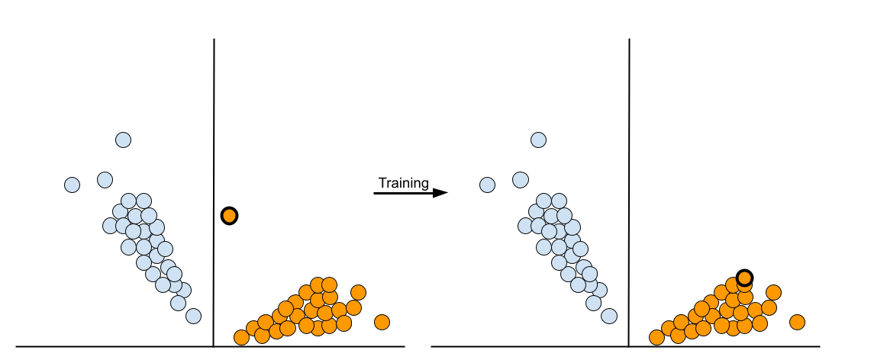
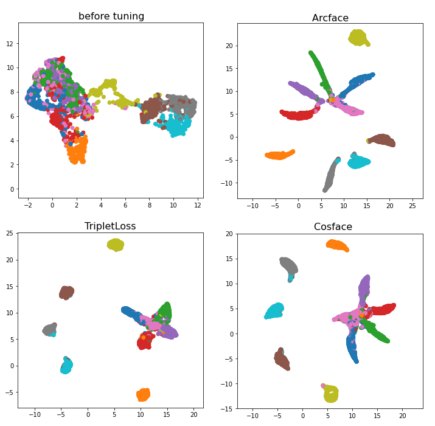

(advanced-losses-optimizers-poolers)=
# {octicon}`mortar-board` Advanced loss functions, optimizers and poolers
Many of the models supported by Finetuner use of similar methods during finetuning, like methods for *calculating loss*, *sampling* and *pooling* . Finetuner offers alternative methods for each of these tasks, and in some cases, choosing specific methods can improve Finetuner performance.

## Loss functions

Loss functions are used to calculate the quality of embeddings while training; the higher the output of the loss function, the larger the update to the parameters of the model.
By default we use `TripletMarginLoss`, however we support many other loss functions as well, including `ArcFaceLoss` and `CosFaceLoss`.

```{Important}
Please check the [developer reference](../../api/finetuner/#finetuner.fit) to get the available options for `loss`.
```

### TripletMarginLoss

Let's first take a look at our default loss function, `TripletMarginLoss`.  

`TripletMarginLoss` is a *contrastive* loss function, meaning that the loss is calculated by comparing the embeddings of multiple documents (3 to be exact) documents to each other.
Each triplet of documents consists of an anchor document, a positive document and a negative document.
The anchor and the positive document belong to the same class, and the negative document belongs to a different class.
The goal of `TripletMarginLoss` is to maximise the difference between the distance from the anchor to the positive document, and the distance from the anchor to the negative document.
For a more detailed explanation on Triplet Loss, as well as how samples are gathered to create these triplets, see {doc}`/advanced-topics/negative-mining/`.

### SphereFace losses

SphereFace loss is a loss function that was first formulated for computer vision and face recognition tasks.
Finetuner supports two variations of this loss function, `ArcFaceLoss` and `CosFaceLoss`.
Instead of attempting to minimise the distance between positive pairs and maximise the distance between negative pairs, the SphereFace loss functions compare each sample with an estimate of the center point of each classes' embeddings.
and attempt to minimize the *angular distance* between the document and its class centroid, and maximise the angular distance between the document and the centroids of the other classes.



The `ArcFaceLoss` and `CosFaceLoss` both deviate from the traditional SphereFace loss by including a margin and scaling parameter, which can be used to increase the boundary between each class.
If an item's embedding is within the boundary of the class it belongs to, then no loss is incurred. Choosing appropriate values for the margin and scaling parameter is very important for effective training.
For more information on how `ArcFaceLoss` and `CosFaceLoss` calculate loss, and how these parameters affect the output, see this article on [loss metrics for deep learning](https://hav4ik.github.io/articles/deep-metric-learning-survey#cosface).  

`TripletMarginLoss` uses a `ClassSampler` to construct batches with an equal number of samples of each class in the batch. However, since only one sample is needed to calculate the loss with the `ArcFaceLoss` and `CosFaceLoss` functions, there are no constraints on what each batch needs to contain.
Therefore we can construct batches using random sampling, which is a much simpler and less time consuming method.
By default, runs created using `ArcFaceLoss` or `CosfaceLoss` will use random sampling, however you can specify which type of sampling method you would like to use like so:

```diff
run = finetuner.fit(
    ...,
    loss='ArcFaceLoss',
+   sampler='random'      # use random sampling
+   sampler='class'       # use class sampling
+   sampler='auto'        # infer sampling method based on the loss function (default)

)
```

In cases where the chosen loss function is a form of contrastive loss, such as the default `TripletMarginLoss`, or the `ClipLoss` function (the loss function used for `text-to-image` tasks), a class sampler is needed to properly function.
In these cases, this `sampler` parameters is ignored and the `ClassSampler` is always used.

### Using an optimizer

In order to keep track and refine our estimation of the class centers across batches, these SphereFace loss functions require an additional optimizer during training.
By default, the type of optimizer used will be the same as the one used for the model itself, but you can also choose a different optimizer for your loss function using the `loss_optimizer` parameter.
The list of available optimizers are discussed in the [run job](../walkthrough/run-job.md) section.

```diff
run = finetuner.fit(
    ...,
    loss='ArcFaceLoss',
+   loss_optimizer='Adam',
+   loss_optimizer_options={'weight_decay': 0.01}
)
```

### Comparing with TripletMarginLoss

Using these loss functions over the default `TripletMarginLoss` can result in clearer divisions between the domains representing each class in the embedding space.
As an example, the figure below shows the domains of the 10 classes of the [FMNIST dataset](https://github.com/zalandoresearch/fashion-mnist) projected onto 2D space using the `umap` library after training with `TripletMarginLoss`, `ArcFaceLoss` and `CosFaceLoss`.



Each color represents a different class. You can see how all of the loss functions are able to separate some of the classes from the others,
but struggle to separate the green, blue, pink, purple and red classes,
with `TripletMarginLoss` sperarating them the least, and `ArcFaceLoss` separating them the most.

### CosineSimilarityLoss

`CosineSimilarityLoss` is a regression loss function,
which is calculated by comparing the cosine similarity of two embeddings against their ground-truth cosine similarity or some other numerical measure of similarity in the range of 0.0 (completely different) to 1.0 (identical). 
The goal of `CosineSimilarityLoss` is to minimize the MSE (mean squared error) between document pair's cosine score and their ground-truth expected similarity, in order to optimize the model for semantic relatedness, i.e. between images and sentences that describe them in part, between documents that have similar content, etc.

## Pooling layers

Pooling layers are layers in a machine learning model that are used to reduce the dimensionality of data. This is usually done for one of two reasons: to remove unnecessary information contained within an embedding of a larger size, or when a model outputs multiple embeddings and only one embedding is needed. Typically, there are two ways to do this: average pooling or max pooling.
While a model may have many pooling layers within it, it is unwise to replace a pooling layer with another unless it is the last layer of the model.

### GeM pooling

`GeM` (Generalised Mean) pooling is an advanced pooling technique that is popular for computer vision and face recognition tasks.
In cases where your chosen model does have a pooling layer as its last layer, Finetuner allows you to replace the default pooler with a `GeM` pooling layer.
Currently, all of our `text-to-text` and `image-to-image` models support replacing the pooling layer.
For a list of all models that support replacing the pooling layer, see the [Backbone Model](../walkthrough/choose-backbone.md) section.  

The `GeM` pooler has two adjustable parameters: a scaling parameter `p` and an epsilon `eps`.
At `p = 1`, the `GeM` pooler will act like an average pooler.
As `p` increases, more weight is given to larger values, making it act more like max pooling.
`eps` is used to clamp values to be slightly above 0, and altering this won't result in much change to the performance.
By default, `p=3` and `eps=1e-6`. You can specify the pooler and adjust these parameters in a dictionary provided to the `model_options` parameter:
```diff
run = finetuner.fit(
    ...,
    model_options = {
        ...
+       'pooler': 'GeM',
+       'pooler_options': {'p': 2.4, 'eps': 1e-5}
    }
)
```