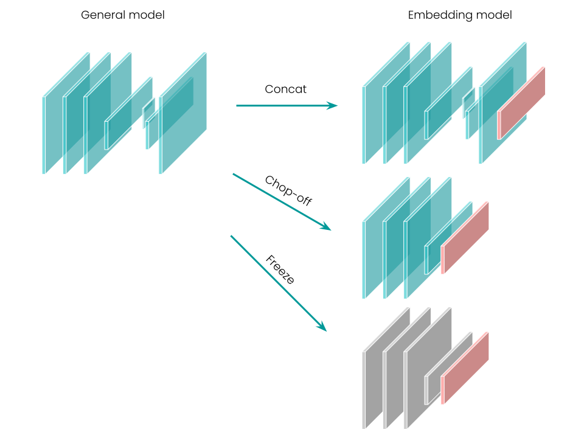

(linear-probe)=
# {octicon}`pin` Linear Probe

## Why freezing?

Depending on your task and the amount of training data,
sometimes it is unnecessary to tune the entire model.
In these cases,
freezing the weights of the pre-trained model and fine-tuning specific layers is sufficient enough.
Besides, freezing can reduce the training time considerably.

Finetuner allows you to fine-tune a Linear Probe (or Projection Head) easily.

```{warning}
Currently, we only allow you to freeze layers for image-to-image search tasks.
These models are built on top of Convolution Neural Networks (CNNs).

For transformer architecture,
we always train the entire Neural Nets.
If this feature is needed, consider submitting a feature request in our [Github Issues page](https://github.com/jina-ai/finetuner/issues)
```

## How?

Finetuner has a built-in module called Tailor.
Given a general model written in Pytorch,
Tailor performs micro-operations on the model architecture and outputs an embedding model.

Given a general model with weights, Tailor preserves its weights and performs (some of) the following steps:

+ Finding all dense layers by iterating over layers.
+ Chopping off all layers after a certain dense layer.
+ Freezing weights of specific layers.
+ Adding a new module on top of the embedding model.



With Finetuner, you can simply put `freeze=True` and `output_dim=X` like this:

```diff
run = finetuner.fit(
    model='resnet50',
    ...,
+   freeze=True,
+   output_dim=1024,  # default output_dim of ResNet50 is 2048.
    ...,
)
```

Finetuner will:

1. Remove the classification head of `ResNet` model, and convert it into an embedding model.
2. Freeze all layers of the embedding model.
3. Attach a trainable 3-layer Linear Probe on top of the embedding model with an `output_dim=1024`.

## Summary

If you want to achieve efficient fine-tuning without training the entire model,
tuning a Linear Probe could be a good solution.
Keep in mind that whenever you use `freeze=True`, always set the `output_dim`.
Otherwise, nothing can be tuned since all layers are frozen.