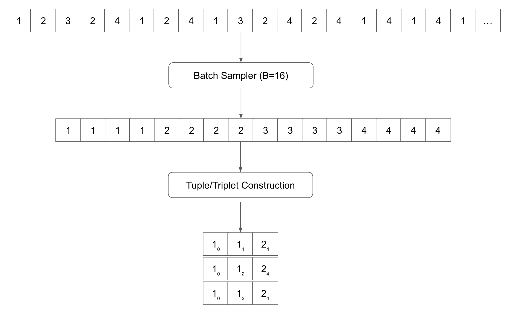
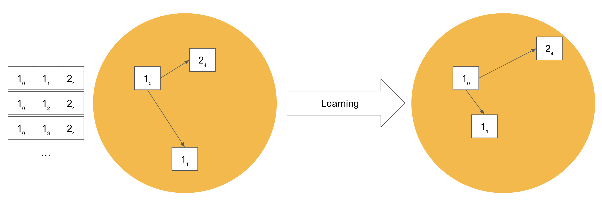
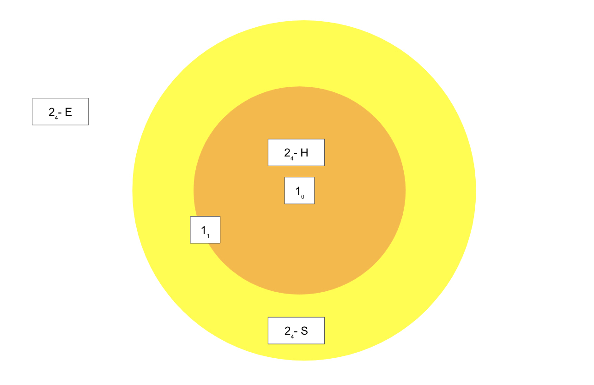

(negative-mining)=
# {octicon}`telescope` Negative Mining

Negative Mining is an advanced machine learning technique, which optimizes the way data is sampled from your training dataset.
Usually, it aims at making the metric learning tasks for the model harder during the training. 
In this way, it can lead to better fine-tuning results.

## Context: Deep Metric Learning

First, let's take a look at how we construct the training data for metric learning tasks.

Metric Learning algorithms attempt to teach neural network models to tell
which objects are semantically/visually similar and which ones are not.

For uni-modal fine-tuning tasks such as text-to-text, image-to-image, or mesh-to-mesh,
Finetuner constructs training data in the following way:



Assume we have a list of Documents belonging to four classes: `1`, `2`, `3`, and `4`,
Finetuner will evenly sample *X* items per class to make a batch *B* which is encoded by the model into a set of embeddings.

Afterward, the loss is calculated based on the relations between the embeddings.
Many of Finetuner's loss functions contrast the embeddings of three items, or a __Triplet__. 
Finetuner creates all possible triplets *(anchor, pos, neg)* from this batch which satisfy the following conditions:
For each triplet, the first is the __anchor__, the second is an embedding that ought to be closer to the embedding of the anchor (has the same label), and the third is one that should be further from the anchor (has a different label).
The objective is to pull the embeddings of items that belong to the same class closer together in the embedding space,
while pushing the embeddings of items which belong to different classes farther away from each other.




## The Triplet Margin Miner

For some triplets, the pre-trained model already performs well, i.e.

the distance between the `anchor` embedding and `pos` is much smaller than
the distance between `anchor` and `neg`?
These triplets do not contribute to improving the model, since they are already in the desired relation to each other in the embedding space.
A more effective way is to use only a subset of all triplets for model training. We call this subset the **hard** or **semi-hard negative samples**.



Let's say `1₀` is an `anchor`, `1₁` is the `pos` while `2₄` is the `neg`, and `D(x,y)` is the distance between the embeddings of `x` and `y`.

If:

+ `D(anchor, neg) < D(anchor, pos) `, then `neg` can be considered as a "hard negative" (`2₄ - H`).
+ `D(anchor, pos) < D(anchor, neg) < D(anchor, pos) + margin`, where `neg` is a little further from the `pos`, but within the margin, then `neg` can be considered as a "semi-hard negative" (`2₄ - S`).
+ `D(anchor, neg) > D(anchor, pos) + margin`, then `neg` can be considered as "easy negative" (`2₄ - E`).

Training is more effective when using only **hard** and **semi-hard** negatives, given a reasonable margin value to distinguish them from **easy** triplets.

## Doing Negative Mining in Finetuner

Finetuner is compatible with the miners provided by the [PyTorch Metric Learning](https://kevinmusgrave.github.io/pytorch-metric-learning) framework.
To select a specific miner, pass its name to the `fit` function, e.g., `AngularMiner`, `TripletMarginMiner`, ...

Please note that the miner has to be compatible with the loss function you selected.
For instance, if you choose to train a model with the `TripleMarginLoss`, you can use the `TripletMarginMiner`.
While without this miner, all possible triples with an anchor, a positive, and a negative candidate are used to calculate the loss, the miner reduces this set of triples.
By default, the miner only selects triples with hard negatives where the distance between the positive and the negative example is inside a margin of `0.2`.
To pass additional parameters to configure the miner, use the `miner_options` parameter of the fit function.
For example, add the following to use only hard-negative triplets and set the margin to `0.3`:

```diff
run = finetuner.fit(
    ...,
    loss='TripleMarginLoss',
+   miner='TripletMarginMiner',
+   miner_options={'margin': 0.3, 'type_of_triplets': 'hard'}
)
```

Possible choices for `type_of_triplets` are:

+ `easy`: Use all easy triplets - all triplets that do not violate the margin.
+ `semihard`: Use semi-hard triplets, but not hard triplets, i.e. those where difference in distance is within the specified margin.
+ `hard`: Use only hard triplets - the negative is closer to the anchor than the positive.
+ `all`: Use `hard` and `semihard` triples - all but the `easy` triples

Finetuner takes `TripleMarginLoss` as its default loss function with no negative mining.
For a detailed description of the miners and their parameters, see the [PyTorch Metric Learning documentation](https://kevinmusgrave.github.io/pytorch-metric-learning/miners/).

## Summary

Metric Learning and triplets are extremely useful for fine-tuning models for similarity search.
Easy triplets have little impact on improving the model.
Consider using semi-hard/hard triplets for model tuning.