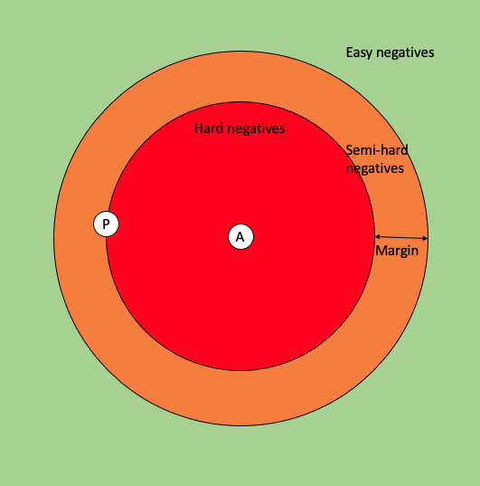

# Loss and Miners

When training your embedding model, it is crucial that the model learns to embed similar items close together in the latent space, and different items far from each other.

For that, you can train your model using the [Triplet or Siamese loss](#triplet-and-siamese-loss). By default, these losses will look at all possible triplets/pairs of embeddings in the batch. As we can expect there to be many "easy" triplets/pairs, you may want to select only the hard ones, to make the model learn faster. For that, you can use [tuple mining](#tuple-mining).

## Triplet and Siamese Loss

Triplet and Siamese loss both compare the distances between the embeddings of similar and dissimilar items, and create a loss that penalizes similar items being too far apart, or dissimilar ones being too close to each other.

### Triplet Loss

Triplet loss works with a triplet composed of an anchor, a positive sample (item similar to the anchor) and a negative sample (item dis-similar from the anchor). The loss for a single such triplet is then computed as

$$\ell_{i, p, n}=\max(0, d(\mathbf{x}_i, \mathbf{x}_p)-d(\mathbf{x}_i, \mathbf{x}_n)+m)$$

Here $\mathbf{x}_i, \mathbf{x}_p, \mathbf{x}_n$ and the embeddings of the anchor, positive and negative sample, respectively, $d$ is a distance function, and $m$ is a desired wedge between the distances of similar and dis-similar items.

### Siamese Loss

Siamese loss works with a tuple of items, an anchor and either a positive or a negative sample. The loss for a single pair is computed as

$$\ell_{i,j} = \mathrm{sim}(i,j)d(\mathbf{x}_i, \mathbf{x}_j) + (1 - \mathrm{sim}(i,j))\max(m - d(\mathbf{x}_i, \mathbf{x}_j))$$

Here $\mathrm{sim}(i,j)$ denotes the similarity function, which returns 1 if items $i$ and $j$ are similar, and 0 if they are dis-similar.

### Use with Tuner

It's straightforward to use these loss functions with the Tuner. You can just give the name of the loss function (as a string) as the `loss` argument on initialization, or you can instantiate the loss object, which allows you to customize parameters (including [miners](#tuple-miners))

````{tab} Pytorch
```python
from finetuner.tuner.pytorch import PytorchTuner
from finetuner.tuner.pytorch.losses import TripletLoss

loss = TripletLoss(distance='cosine', margin=0.5)

tuner = PytorchTuner(..., loss=loss)
```
````
````{tab} Keras
```python
from finetuner.tuner.keras import KerasTuner
from finetuner.tuner.keras.losses import TripletLoss

loss = TripletLoss(distance='cosine', margin=0.5)

tuner = KerasTuner(..., loss=loss)
```
````
````{tab} Paddle
```python
from finetuner.tuner.paddle import PaddleTuner
from finetuner.tuner.paddle.losses import TripletLoss

loss = TripletLoss(distance='cosine', margin=0.5)

tuner = PaddleTuner(..., loss=loss)
```
````

## Tuple Miners

In order to support siamese and triplet training, the `Finetuner` implements different mining strategies. 

This [paper](https://openaccess.thecvf.com/content_WACV_2020/papers/Xuan_Improved_Embeddings_with_Easy_Positive_Triplet_Mining_WACV_2020_paper.pdf) provides a thorough investigation of which mining strategies should be used and why. 

### Parameters

* **pos_strategy**: 
    * 'hard': Returns the hardest positive sample for each anchor.
    * 'semihard': Returns the hardest positive sample for each anchor anchor, such that it is closer than the selected negative.
    * 'easy': Returns the easiest positive sample for each anchor.
    * 'all': Returns all possible positive samples.
* **neg_strategy**: 
    * 'hard': Returns the hardest negative sample for each anchor.
    * 'semihard': Returns the hardest negative sample for each anchor, such that it is further than the selected positive.
    * 'easy': Returns the easiest negative sample for each anchor.
    * 'all': Returns all possible negative samples.
+ **Restricted Combinations**: 
    * `pos_strategy` and `neg_strategy` cannot be set to `semihard` at the same time.
    * If either `pos_strategy` or `neg_strategy` is set to semihard, the other cannot be set to `all`.

The image below illustrates the relative position of samples in the case of triplet training and will help us to define the necessary terminology. 

<!--  -->
 </br>

The white circle in the middle (`A`) will denotes our anchor sample $\mathrm{x}_i$ and the white circle on the left (`P`) denotes our positive sample $\mathrm{x}_p$. Depending on where our negative sample will fall, inside the encoding space, it will be either *hard*, *semihard* or an *easy* sample. 

To make this a bit more formal, a negative sample is considered to be *hard*, when it its distance to the anchor sample is smaller than the distance between the anchor and the positive sample, i. e. $d(\mathrm{x}_i,\mathrm{x}_n) < d(\mathrm{x}_i,\mathrm{x}_p)$.
When a negative sample is just *a little* further from the postive sample $\mathrm{x}_i$, but within a $\mathrm{margin}$, the sample is considered to be *semihard*. 
Formally: $d(\mathrm{x}_i,\mathrm{x}_n) < d(\mathrm{x}_i,\mathrm{x}_p) + \mathrm{margin}$. 
Any negative sample that is even further away from the anchor, is considered an *easy* sample, i. e. $d(\mathrm{x}_i,\mathrm{x}_n) > d(\mathrm{x}_i,\mathrm{x}_p)$.

In order to apply mining, during siamese- or triplet training with the *Finetuner*, you simply need to add the desired miner to your loss. 

````{tab} Pytorch
```python
from finetuner.tuner.pytorch import PytorchTuner
from finetuner.tuner.pytorch.miner import TripletEasyHardMiner
from finetuner.tuner.pytorch.losses import TripletLoss

loss = TripletLoss(miner=TripletEasyHardMiner(pos_strategy='easy', neg_strategy='hard'))

tuner = PytorchTuner(..., loss=loss)
```
````
````{tab} Keras
```python
from finetuner.tuner.keras import KerasTuner
from finetuner.tuner.keras.miner import TripletEasyHardMiner
from finetuner.tuner.keras.losses import TripletLoss

loss = TripletLoss(miner=TripletEasyHardMiner(pos_strategy='easy', neg_strategy='hard'))

tuner = KerasTuner(..., loss=loss)
```
````

````{tab} Paddle
```python
from finetuner.tuner.paddle import PaddleTuner
from finetuner.tuner.paddle.miner import TripletEasyHardMiner
from finetuner.tuner.paddle.losses import TripletLoss

loss = TripletLoss(miner=TripletEasyHardMiner(pos_strategy='easy', neg_strategy='hard'))

tuner = PaddleTuner(..., loss=loss)
```
````