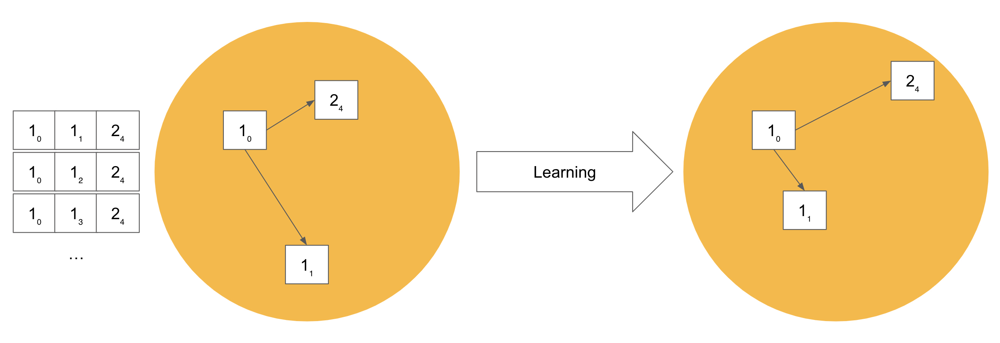

(loss-function)=
# {octicon}`number` Loss Functions

The choice of loss functions relies heavily on your data. In summary, you should utilize loss functions when:

| data type                                 | loss function                                     |
|-------------------------------------------|---------------------------------------------------|
| article-label tuple                       | `TripletMarginLoss`, `ArcFaceLoss`, `CosFaceLoss` |
| text-image tuple                          | `CLIPLoss`                                        |
| query-article-score triplets              | `CosineSimilarityLoss`                            |
| query-article tuple                       | `MultipleNegativeRankingLoss`                     |
| query-article-irrelevant_article triplets | `MarginMSELoss`                                   |

For more information, please checkout {doc}`/concepts/data-preparation` .

## TripletMarginLoss

`TripletMarginLoss` is a *contrastive* loss function, meaning that the loss is calculated by comparing the embeddings of multiple documents (3 to be exact) documents to each other.
Each triplet of documents consists of an anchor document, a positive document and a negative document.
The anchor and the positive document belong to the same class, and the negative document belongs to a different class.
The goal of `TripletMarginLoss` is to minimize the difference between the distance from the anchor to the positive document, and maximize the distance from the anchor to the negative document.

## ArcFaceLoss and CosFaceLoss

SphereFace loss is a loss function that was first formulated for computer vision and face recognition tasks.
Finetuner supports two variations of this loss function, `ArcFaceLoss` and `CosFaceLoss`.
Instead of attempting to minimize the distance between positive pairs and maximize the distance between negative pairs, the SphereFace loss functions compare each sample with an estimate of the center point of each class's embeddings.
and attempt to minimize the *angular distance* between the document and its class centroid, and maximize the angular distance between the document and the centroids of the other classes.

The `ArcFaceLoss` and `CosFaceLoss` both deviate from the traditional SphereFace loss by including a margin and scaling parameter, which can be used to increase the boundary between each class.
If an item's embedding is within the boundary of the class it belongs to, then no loss is incurred. Choosing appropriate values for the margin and scaling parameter is very important for effective training.
For more information on how `ArcFaceLoss` and `CosFaceLoss` calculate loss, and how these parameters affect the output, see this article on [loss metrics for deep learning](https://hav4ik.github.io/articles/deep-metric-learning-survey#cosface).  

`TripletMarginLoss` uses a `ClassSampler` to construct batches with an equal number of samples of each class in the batch. However, since only one sample is needed to calculate the loss with the `ArcFaceLoss` and `CosFaceLoss` functions, there are no constraints on what each batch needs to contain.
Therefore we can construct batches using random sampling, which is a much simpler and less time consuming method.
By default, runs created using `ArcFaceLoss` or `CosfaceLoss` will use random sampling, however you can specify which type of sampling method you would like to use with the `sampler` parameter:

```diff
run = finetuner.fit(
    ...,
    loss='ArcFaceLoss',
+   sampler='random'      # use random sampling
+   sampler='class'       # use class sampling
+   sampler='auto'        # infer sampling method based on the loss function (default)

)
```

In cases where the chosen loss function is a form of contrastive loss, such as the default `TripletMarginLoss`, or the `ClipLoss` function (the loss function used for `text-to-image` tasks), a class sampler is needed to properly function.
In these cases, this `sampler` parameter is ignored and the `ClassSampler` is always used.

## CLIPLoss

The `CLIPLoss` is designed to maximize the agreement between image-text pairs that are semantically related,
while minimizing the agreement between pairs that are unrelated.
This encourages the model to learn a joint representation space where images and texts with similar meanings are close together.
The loss function measures how well the CLIP model can encode the similarity between an image and its associated text.
It uses a measure called cosine similarity,
which calculates the cosine of the angle between two vectors.
The higher the cosine similarity value, the closer the vectors are in the joint representation space.

## CosineSimilarityLoss

`CosineSimilarityLoss` is a regression loss function,
which is calculated by comparing the cosine similarity of two embeddings against their ground-truth cosine similarity or some other numerical measure of similarity in the range of 0.0 (completely different) to 1.0 (identical). 
The goal of `CosineSimilarityLoss` is to minimize the MSE (mean squared error) between document pair's cosine score and their ground-truth expected similarity, in order to optimize the model for semantic relatedness, i.e. between images and sentences that describe them in part, between documents that have similar content, etc.

## MarginMSELoss

```{admonition} Note
:class: hint
Use `MarginMSELoss` together with data synthesis.
Check out {doc}`/concepts/synthesis-function` for more information.
```

`MarginMSELoss` calculates the mean squared error between the margins of two similarity values.
It operates on triplets consisting of a query embedding, an embedding of a positive example,
and an embedding of a negative example.
The similarity between the query and the positive example, as well as the similarity between the query and the negative example, are computed.
The margin is then obtained by taking the difference between these two similarity values.
The loss is calculated as the mean squared error between the computed margin and a target margin value.

## Negative Mining

Negative Mining is an advanced machine learning technique, which optimizes the way data is sampled from your training dataset.
Usually, it aims at making the metric learning tasks for the model harder during the training.
During training, negative mining focuses on making the metric learning task more challenging for the model.
It achieves this by carefully selecting negative samples from the dataset.
This can lead to better fine-tuning results.

### Context: Deep Metric Learning

First, let's take a look at how we construct the training data for metric learning tasks.

Metric Learning algorithms attempt to teach neural network models to tell
which objects are semantically/visually similar and which ones are not.

For uni-modal fine-tuning tasks such as text-to-text, image-to-image, or mesh-to-mesh,
Finetuner constructs training data in the following way:


Assume we have a list of Documents belonging to four classes: `1`, `2`, `3`, and `4`,
Finetuner will evenly sample *X* items per class to make a batch *B* which is encoded by the model into a set of embeddings.

Afterward, the loss is calculated based on the relations between the embeddings.
Many of Finetuner's loss functions contrast the embeddings of three items, or a __Triplet__. 
Finetuner creates all possible triplets *(anchor, pos, neg)* from this batch which satisfy the following conditions:
For each triplet, the first is the __anchor__, the second is an embedding that ought to be closer to the embedding of the anchor (has the same label), and the third is one that should be further from the anchor (has a different label).
The objective is to pull the embeddings of items that belong to the same class closer together in the embedding space,
while pushing the embeddings of items which belong to different classes farther away from each other.




### The Triplet Margin Miner

For some triplets, the pre-trained model already performs well, i.e.

the distance between the `anchor` embedding and `pos` is much smaller than
the distance between `anchor` and `neg`?
These triplets do not contribute to improving the model, since they are already in the desired relation to each other in the embedding space.
A more effective way is to use only a subset of all triplets for model training. We call this subset the **hard** or **semi-hard negative samples**.


Let's say `1₀` is an `anchor`, `1₁` is the `pos` while `2₄` is the `neg`, and `D(x,y)` is the distance between the embeddings of `x` and `y`.

If:

+ `D(anchor, neg) < D(anchor, pos) `, then `neg` can be considered as a "hard negative" (`2₄ - H`).
+ `D(anchor, pos) < D(anchor, neg) < D(anchor, pos) + margin`, where `neg` is a little further from the `pos`, but within the margin, then `neg` can be considered as a "semi-hard negative" (`2₄ - S`).
+ `D(anchor, neg) > D(anchor, pos) + margin`, then `neg` can be considered as "easy negative" (`2₄ - E`).

Training is more effective when using only **hard** and **semi-hard** negatives, given a reasonable margin value to distinguish them from **easy** triplets.

### Doing Negative Mining in Finetuner

Finetuner is compatible with the miners provided by the [PyTorch Metric Learning](https://kevinmusgrave.github.io/pytorch-metric-learning) framework.
To select a specific miner, pass its name to the `fit` function, e.g., `AngularMiner`, `TripletMarginMiner`, ...

Please note that the miner has to be compatible with the loss function you selected.
For instance, if you choose to train a model with the `TripleMarginLoss`, you can use the `TripletMarginMiner`.
While without this miner, all possible triples with an anchor, a positive, and a negative candidate are used to calculate the loss, the miner reduces this set of triples.
By default, the miner only selects triples with hard negatives where the distance between the positive and the negative example is inside a margin of `0.2`.
To pass additional parameters to configure the miner, use the `miner_options` parameter of the fit function.
For example, add the following to use only hard-negative triplets and set the margin to `0.3`:

```diff
run = finetuner.fit(
    ...,
    loss='TripleMarginLoss',
+   miner='TripletMarginMiner',
+   miner_options={'margin': 0.3, 'type_of_triplets': 'hard'}
)
```

Possible choices for `type_of_triplets` are:

+ `easy`: Use all easy triplets - all triplets that do not violate the margin.
+ `semihard`: Use semi-hard triplets, but not hard triplets, i.e. those where difference in distance is within the specified margin.
+ `hard`: Use only hard triplets - the negative is closer to the anchor than the positive.
+ `all`: Use `hard` and `semihard` triples - all but the `easy` triples

Finetuner takes `TripleMarginLoss` as its default loss function with no negative mining.
For a detailed description of the miners and their parameters, see the [PyTorch Metric Learning documentation](https://kevinmusgrave.github.io/pytorch-metric-learning/miners/).
