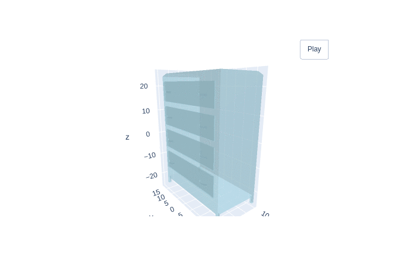
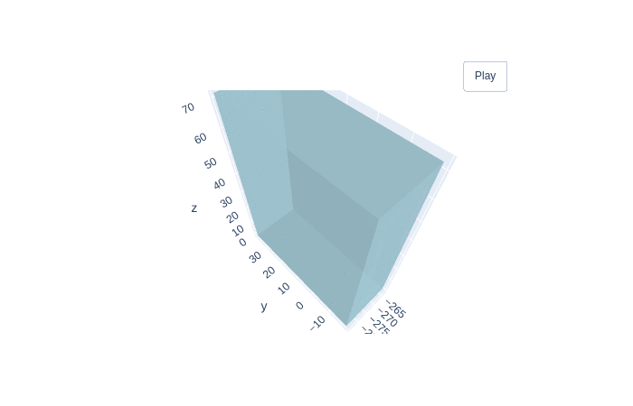
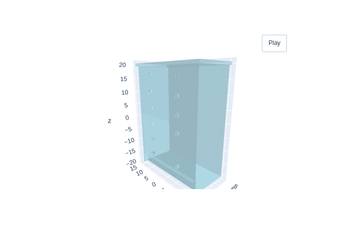

# Finetuning PointConv on ModelNet40 Dataset

In this tutorial we will finetune PointConv on [ModelNet40 dataset](https://arxiv.org/pdf/1406.5670v3.pdf).
The ModelNet40 dataset contains synthetic object point clouds. As the most widely used benchmark for point cloud analysis, ModelNet40 is popular because of its various categories, clean shapes, well-constructed dataset.

The original ModelNet40 consists of 12,311 CAD-generated meshes in 40 categories (such as airplane, car, plant, lamp), of which 9,843 are used for training while the rest 2,468 are reserved for testing.

```{tip}
ModelNet: a consistent, large-scale dataset of 3D objects annotated with fine-grained, instance-level, and hierarchical 3D part information.
The corresponding point cloud data points are uniformly sampled from the mesh surfaces, and then further preprocessed by moving to the origin and scaling into a unit sphere. This dataset is used to establish three benchmarking tasks for evaluating 3D part recognition: fine-grained semantic segmentation and classification. In our case we'll use it to finetune PointConv which was pretrained on [ShapeNet dataset](https://arxiv.org/abs/1512.03012).
```

You can download ModelNet dataset from the official [Princeton website](https://modelnet.cs.princeton.edu/).

```shell
wget http://modelnet.cs.princeton.edu/ModelNet40.zip

```

## Data preparation

After downloading ModelNet data we need to unzip it.

```shell
pip install finetuner
pip install trimesh

unzip ModelNet40.zip
```

Before we go further let's look at some examples from our data:

```{figure} airplane.gif
:align: center
:width: 70%
```

```{figure} lap.gif
:align: center
:width: 70%
```

Now let's go to loading our data. We'll use `DocumentArray` from the library [DocArray]((https://github.com/jina-ai/docarray)). We'll go through
all the files in our directory and we'll recursively read all files that end with .off.
We split the files into two `DocumentArray`s depending on their uri to train and test.

Finally we save the resulting `DocumentArray`s into binary files for later use.

```python
import glob
import os
from typing import Optional

import trimesh
from docarray import Document, DocumentArray

train = DocumentArray()
test = DocumentArray()
data_path = 'ModelNet40'
all_docs = DocumentArray.from_files(os.path.join(data_path,'/**/**/*.off'))
for doc in all_docs:
    if 'test' in doc.uri:
        test.append(doc)
    else:
        train.append(doc)

train.save_binary('train_data_modelnet.bin')
test.save_binary('test_data_modelnet.bin')

```

## Model Training

Now that we have our data ready, we need a model that creates embeddings so that we can later use these embeddings for searching similar matches for different queries. A lot of work and research has been done in the field of 3D data embeddings and there are some powerful models like [PointConv](https://arxiv.org/abs/1811.07246) which have been trained on [ShapeNet dataset](https://arxiv.org/pdf/1512.03012.pdf)

In order to not reinvent the wheel we will use this model. We will also use Jina's 3D Mesh Encoder which wraps these two models in an executor.
This executor receives Documents containing point sets data in its blob attribute, with shape (N, 3) and encodes them to embeddings of shape (D,). Now, the following pretrained models are ready to be used to create embeddings:

- PointConv-Shapenet-d512: A PointConv model finetuned on ShapeNet dataset, resulting in 512 dimension of embeddings.
- PointConv-Shapenet-d1024: A PointConv model finetuned on ShapeNet dataset, resulting in 1024 dimension of embeddings.

As we already have an Encoder that uses `PointConv` to embed data let's use it.  

```shell
git clone https://github.com/jina-ai/executor-3d-encoder.git
```

We also import necessary libraries:

```python
import pathlib
from functools import partial

import numpy as np
import torch
from docarray import Document, DocumentArray
from models import MeshDataModel

import finetuner
from finetuner.tuner.pytorch.losses import TripletLoss
from finetuner.tuner.pytorch.miner import TripletEasyHardMiner
```

We define some helper functions for preprocessing and sampling. We convert every `Document` into a point cloud
tensor using `.load_uri_to_point_cloud_tensor`, we can also pass the number of point you want, here we pass 2048.

Along with loading point clouds, we also assign the `finetuner_label` as a tag. This label will be later used during finetuning.

```python
def random_sample(pc, num):
    permutation = np.arange(len(pc))
    np.random.shuffle(permutation)
    pc = np.array(pc).astype('float32')
    pc = pc[permutation[:num]]
    return pc


def preprocess(doc: 'Document', num_points: int = 1024, data_aug: bool = True):
    doc.load_uri_to_point_cloud_tensor(2048)
    doc.tags['finetuner_label'] = doc.uri.split('/')[2]
    points = random_sample(doc.tensor, num_points)

    points = points - np.expand_dims(np.mean(points, axis=0), 0)  # center
    dist = np.max(np.sqrt(np.sum(points ** 2, axis=1)), 0)
    points = points / dist  # scale

    if data_aug:
        theta = np.random.uniform(0, np.pi * 2)
        rotation_matrix = np.array(
            [[np.cos(theta), -np.sin(theta)], [np.sin(theta), np.cos(theta)]]
        )
        points[:, [0, 2]] = points[:, [0, 2]].dot(rotation_matrix)  # random rotation
        points += np.random.normal(0, 0.02, size=points.shape)  # random jitter
    return points
```

In the following code snippet we create MeshData model which encapsulates a `PointConv` model with 512 dimensions, we then load
training and evaluation data from the binary files we saved before. We create an optimizer and a learning rate scheduler. In this case with use
an Adam optimizer and MultiStepLR scheduler but you can change those depending on your data and preferences.

```python
model = MeshDataModel(model_name='pointconv', embed_dim=512) # create pointconv model with 512 dimensions

train = DocumentArray.load_binary('train_data_modelnet.bin') # load train dataset
eval = DocumentArray.load_binary('test_data_modelnet.bin') # load eval dataset

def configure_optimizer(model):
    from torch.optim import Adam
    from torch.optim.lr_scheduler import MultiStepLR
    # create Adam optimizer with MultistepLR scheduler
    optimizer = Adam(model.parameters(), lr=5e-4)
    scheduler = MultiStepLR(optimizer, milestones=[30, 60], gamma=0.5)

    return optimizer, scheduler
```

We leverage finetuner's mining strategy to improve and finetune the embeddings. By this we mean that the finetuner will use
the mentioned label coming with every `Document` which we specified during preprocessing and will sample it as a positive example
and then sample examples with different label as negatives.

The triplet loss's goal is to pull `Documents` with same class together and those with different classes away from each other thus improving
the final representation. If you wish to learn more about triplet loss and miners click [here](https://finetuner.jina.ai/components/tuner/loss/#loss-and-miners).

We also use our built-in callback `WandBLogger` to be able to track our training. Note you must first download the wandb client and log into your account which you can do like this:

```shell
pip install wandb
wandb login
```

To learn more about callbacks click [here](https://finetuner.jina.ai/components/tuner/callbacks/#callbacks), now let's go to finetuning:

```python
from finetuner.tuner.callback import WandBLogger 

logger = WandBLogger()

tuned_model = finetuner.fit(
    model,
    train,
    eval_data=eval,
    preprocess_fn=partial(preprocess, num_points=2048, data_aug=True),
    epochs=50,
    batch_size=64,
    loss=TripletLoss(
        miner=TripletEasyHardMiner(pos_strategy='easy', neg_strategy='semihard')
    ),
    configure_optimizer=configure_optimizer,
    learning_rate=5e-4,
    device='cuda',
    callbacks=[logger],
)
# saving the finetuner model
torch.save(
    tuned_model.state_dict(),
    str(checkpoint_dir / f'finetuned-{model_name}-d{embed_dim}.pth'),
)
```

## Evaluating embedding quality & Results

Now let's see whether we made an improvement or not. We will use the training data as index and the testing data as query. We'll embed them both
and then search for test 3d objects (the query) in our training data (index). We do this using the pretrained model and the finetuned model and then compare top matches.

We'll use two metrics to evaluate our two models (pretrained, straight out of the box model and finetuned model) on the search task:

**mAP@k** : We'll calculate the average precision at 1, 5 and 10, then we'll calculate the mean of those average precisions for all documents in our test data (these are our queries) because we care about how accurate and precise our retrieved 3D objects are.

**mNDCG@k**: We'll calculate NDCG at 1,5 and 10, then we'll calculate the mean of those for all documents in our test data  because we care about the order of the retrieved 3D objects.

````{dropdown} Complete source code

```python
from finetuner.tuner.evaluation import Evaluator

train = DocumentArray.load_binary('../train_data_modelnet.bin') # load train dataset
val = DocumentArray.load_binary('../test_data_modelnet.bin') # load test dataset

train.apply(preprocess)
val.apply(preprocess)

tuned_model = MeshDataModel(model_name='pointconv', embed_dim=512) # create pointconv model with 512 dimensions
pretrained_model = MeshDataModel(model_name='pointconv', embed_dim=512)

tuned_model.load_state_dict(torch.load('checkpoints/finetuned-pointconv-d512.pth')) # load finetuned weights

tuned_model.eval()
pretrained_model.eval()

evaluator_finetuned = Evaluator(val, train, tuned_model)
print(evaluator_finetuned.evaluate())

evaluator_pretrained = Evaluator(val, train, pretrained_model)
print(evaluator_pretrained.evaluate())
```
````

The difference is shown in the tables below:

| mAP@k  | pre-trained | fine-tuned |
|--------|-------------|------------|
| mAP@1  | 0.147       | 0.719      |
| mAP@5  | 0.113       | 0.697      |
| mAP@10 | 0.100       | 0.686      |

| mNDCG@k  | pre-trained | fine-tuned |
|--------|-------------|--------------|
| mNDCG@1  | 0.563       | 0.927      |
| mNDCG@5  | 0.617       | 0.931      |
| mNDCG@10 | 0.647       | 0.935      |

Now let's do some queries ourselves and check the visualizations

````{dropdown} Complete source code

```python
train_da = DocumentArray.load_binary('../train_data_modelnet.bin') # load train dataset
eval_da = DocumentArray.load_binary('../test_data_modelnet.bin') # load eval dataset

train_da.apply(preprocess)
eval_da.apply(preprocess)

tuned_model = MeshDataModel(model_name='pointconv', embed_dim=512) # create pointconv model with 512 dimensions
tuned_model.load_state_dict(torch.load('checkpoints/finetuned-pointconv-d512.pth'))
tuned_model.eval()

train_da.embed(tuned_model, batch_size=128, device='cuda')
eval_da.embed(tuned_model, batch_size=128, device='cuda')

eval_da.match(train_da, limit=10)
```
````

Query:

```{figure} radio_query.gif
:align: center
:width: 70%
```

Pretrained PointConv:

```{figure} radio_oob.gif
:align: center
:width: 70%
```

Finetuned PointConv:

```{figure} radio_finetuned.gif
:align: center
:width: 70%
```

Query:

```{figure} dresser_query.gif
:align: center
:width: 70%
```

Pretrained PointConv:

```{figure} dresser_oob.gif
:align: center
:width: 70%
```

Finetuned PointConv:

```{figure} dresser_finetuned.gif
:align: center
:width: 70%
```

Query                      |  Pretrained PointConv     | Finetuned PointConv
:-------------------------:|:-------------------------:|:--------------------:
  |   | 

We can clearly see that after finetuning PointConv has enhanced embeddings, and that's how you finetune a 3D model.
