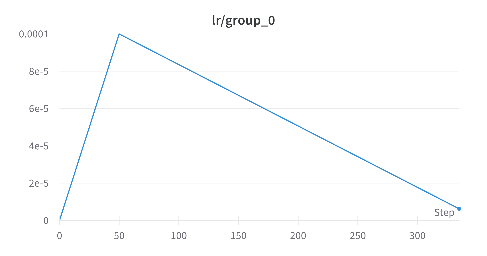
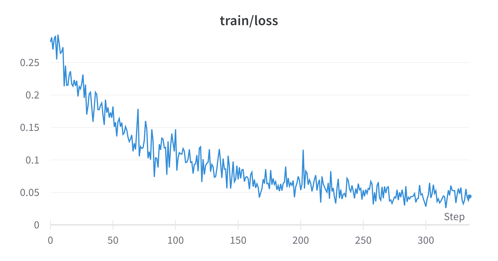
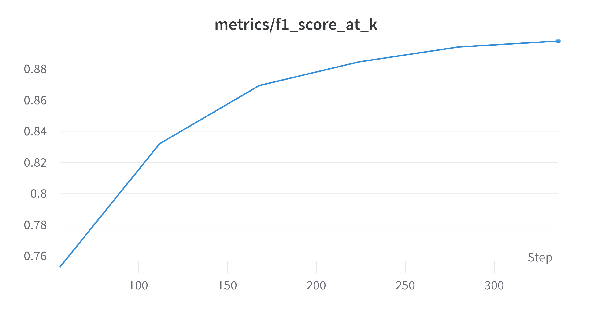
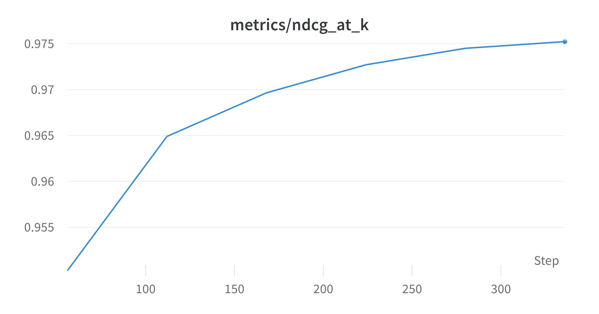

# Finetuning a Transformer for Intent Classification

````{info}
This example builds a transformer model using `pytorch` and the `transformers` package. You can install both packages using:

```
pip install torch transformers
```
````

This example demonstrates how to finetune a model on textual data using `finetuner`.
Specifically we will tune a transformer model on an Intent Classification task. Intent
classification is the problem where we try to predict the user intent from a user utterance.
It is a common step in chatbots and Conversational AI, where after the user speech has been
decoded to text, we try to represent the meaning of the text symbolically by predicting
intents and semantic entities. For example:

* I want to book a flight - intent: `book-flight`
* What is the weather forecast for tomorrow? - intent: `get-weather`

The intent classification task is usually formulated as text classification i.e. we build
a classifier to predict intents on input text. In this example, we will formulate
the problem as a search task and use `finetuner` to tune text representations. We will build
an embedding model that embeds text to a high dimensional space and then we will tune the
model so that texts that belong to the same class (intent) are represented in proximity
and texts that belong to separate classes are pulled apart in our embedding space. To 
convert our embedding model back to a useful intent prediction model, we will implement a
simple nearest neighbor rule.


## CLINC150

We will use the CLINC150 dataset as the base of our experiment. It is a dataset of
utterance-intent pairs and is commonly used for evaluating intent models. It comes
in train, val and test splits and contains 150 intents from various chatbot domains.
For more info on the CLINC150 dataset, check out the
[dataset repo](https://github.com/clinc/oos-eval).

Firstly, let's clone the dataset locally:
```
git clone https://github.com/clinc/oos-eval.git
```

CLINC150 comes in different sizes with regards to the number of utterances per intent,
to facilitate experimentation on few-shot learning methods. We will use the full version
which should be located in `./oos-eval-master/data/data_full.json`.

The dataset is a JSON file with utterance intent pairs. We convert the train, val and
test split to `DocumentArray`s and attach the intent label for each doc in 
`doc.tags['finetuner_label']`.

```python
import json

from docarray import Document, DocumentArray

DATASET_PATH = 'oos-eval-master/data/data_full.json'

with open(DATASET_PATH, 'r') as f:
    data = json.load(f)

train_data = DocumentArray(
    [
        Document(text=utterance, tags={'finetuner_label': intent})
        for utterance, intent in data['train']
    ]
)
val_data = DocumentArray(
    [
        Document(text=utterance, tags={'finetuner_label': intent})
        for utterance, intent in data['val']
    ]
)
test_data = DocumentArray(
    [
        Document(text=utterance, tags={'finetuner_label': intent})
        for utterance, intent in data['test']
    ]
)

print(f'Num train samples: {len(train_data)}')
print(f'Num val samples: {len(val_data)}')
print(f'Num test samples: {len(test_data)}')
```
```
Num train samples: 15000
Num val samples: 3000
Num test samples: 4500
```

Let's investigate the intent distribution. We use `collections.Counter` to compute
the distribution of our train, val and test intents as well as the average number of
utterances per intent in all 3 splits.

```python
from collections import Counter

train_intents = Counter([doc.tags['finetuner_label'] for doc in train_data]).most_common()
val_intents = Counter([doc.tags['finetuner_label'] for doc in val_data]).most_common()
test_intents = Counter([doc.tags['finetuner_label'] for doc in test_data]).most_common()

num_utts_per_intent_train = sum([v for _, v in train_intents]) / len(train_intents)
num_utts_per_intent_val = sum([v for _, v in val_intents]) / len(val_intents)
num_utts_per_intent_test = sum([v for _, v in test_intents]) / len(test_intents)

print(f'Num train intents: {len(train_intents)}')
print(f'Num val intents: {len(val_intents)}')
print(f'Num test intents: {len(test_intents)}')

print(f'Avg num utterances per intent in train set: {num_utts_per_intent_train}')
print(f'Avg num utterances per intent in val set: {num_utts_per_intent_val}')
print(f'Avg num utterances per intent in test set: {num_utts_per_intent_test}')
```
```
Num train intents: 150
Num val intents: 150
Num test intents: 150
Avg num utterances per intent in train set: 100.0
Avg num utterances per intent in val set: 20.0
Avg num utterances per intent in test set: 30.0
```

## Embedding model

As described above, we will use `finetuner` to finetune an embedding model in order
to bring representations of the same intent, closer in the embedding space. For that
we will use the `transformers` library to define a transformer-based embedding model.
We will load a pre-trained transformer as our starting point, the `paraphrase-MiniLM-L6-v2`
model from `sentence-transformers`. Check out the links below for more information on
this specific model as well as sentence transformers in general:

* https://huggingface.co/sentence-transformers/paraphrase-MiniLM-L6-v2
* https://www.sbert.net/index.html

```python
import torch
from transformers import AutoModel

TRANSFORMER_MODEL = 'sentence-transformers/paraphrase-MiniLM-L6-v2'

def mean_pooling(model_output, attention_mask):
    token_embeddings = model_output[0]
    input_mask_expanded = (
        attention_mask.unsqueeze(-1).expand(token_embeddings.size()).float()
    )
    return torch.sum(token_embeddings * input_mask_expanded, 1) / torch.clamp(
        input_mask_expanded.sum(1), min=1e-9
    )

class TransformerEmbedder(torch.nn.Module):
    def __init__(self):
        super().__init__()
        self.model = AutoModel.from_pretrained(TRANSFORMER_MODEL)

    def forward(self, inputs):
        out = self.model(**inputs)
        return mean_pooling(out, inputs['attention_mask'])
```

Our model is a pre-trained embedding model, i.e. it outputs a high-dimensional representation
given some input text and it has been pre-trained on large text corpora. To use the model
defined above, we need to be able to convert raw text to the tensor format that our model
accepts as input. To do that, we need to use the BPE tokenizer, provided by the `transformers`
package, that converts texts to BPE encoded arrays that our model accepts as input. We make
use of the collate function that `finetuner`supports. The collate function offers a way to
specify the conversion of batch elements to model input tensors.

```python
from typing import List

from transformers import AutoTokenizer

MAX_SEQ_LEN = 50
tokenizer = AutoTokenizer.from_pretrained(TRANSFORMER_MODEL)

def collate_fn(inputs: List[str]):
    return tokenizer(
        inputs,
        truncation=True,
        max_length=MAX_SEQ_LEN,
        padding=True,
        return_tensors='pt',
    )
```

## Pre-trained model performance

Before proceeding with the fine-tuning, we should evaluate the performance of the
pre-trained model, so that after fine-tuning we can evaluate again and compare the results.
To evaluate the model, we can use the built-in `Evaluator` component that allows us to
compute information retireval metrics. We will evaluate on the test split of our dataset:

```python
from finetuner.tuner.evaluation import Evaluator

BATCH_SIZE = 256
NUM_WORKERS = 8
DEVICE = 'gpu' if torch.cuda.is_available() else 'cpu'

pretrained_model = TransformerEmbedder()
evaluator = Evaluator(test_data, embed_model=pretrained_model)
metrics = evaluator.evaluate(
    limit=int(num_utts_per_intent_test),
    num_workers=NUM_WORKERS,
    batch_size=BATCH_SIZE,
    device=DEVICE,
    collate_fn=collate_fn,
)

print('Evaluating PRE-TRAINED model on test data:')
print(json.dumps(metrics, indent=2))
```
```
Evaluating PRE-TRAINED model on test data:
{
  "r_precision": 0.6597606769142386,
  "precision_at_k": 0.5920919540229873,
  "recall_at_k": 0.5920919540229873,
  "f1_score_at_k": 0.5920919540229873,
  "average_precision": 0.817989559018391,
  "hit_at_k": 0.9962222222222222,
  "reciprocal_rank": 0.9344587442949851,
  "dcg_at_k": 6.55171986283775,
  "ndcg_at_k": 0.908690691171733
}
```

Out of the box, the pre-trained model has a solid performance on our dataset. This means
that pre-training enables the model to learn good representations that map semantically
similar texts nearby in the embedding space. Let's see if we can improve using `finetuner`.


## Fine-tuning

We will finetune the model for 6 epochs using a batch size of 256. We are using a learning
rate of 1e-4, with the AdamW optimizer and a linear learning rate schedule with warmup.
This weight update strategy is often recommended for finetuning transformer models.
Finetuner allows us to configure the optimizer and the scheduler, via the
`configure_optimizer` argument which should be a function that accepts the model as input
and returns the optimizer and the scheduler as a tuple.

For the training objective, we are using the `TripletLoss` in conjunction with the
`TripletEasyHardMiner` with easy positive and hard negative strategies and a margin of `0.4`.

Finally we make use of the various callbacks provided by `finetuner`, to inject
functionalities in the training loop. Specifically, we use the `EvaluationCallback`
so that metrics are computed on the val set after each epoch, the `EarlyStopping`
callback which monitors the average precision to trigger early stopping if the metric stops
increasing, the `BestModelCheckpoint` that saves the best performing model (in terms of
average precision) every epoch and finally the `WandBLogger` callback that logs our
training information using Weights and Biases.

To use the weights and biases logger, you should install the `wandb` client and login,
provided you have an active account:

```bash
pip install wandb
wandb login
```

Let's start fine-tuning!

```python
import math

import finetuner
from finetuner.tuner.callback import (
    BestModelCheckpoint,
    EarlyStopping,
    EvaluationCallback,
    WandBLogger,
)
from finetuner.tuner.pytorch.losses import TripletLoss
from finetuner.tuner.pytorch.miner import TripletEasyHardMiner
from transformers.optimization import get_linear_schedule_with_warmup

EPOCHS = 6
BATCH_SIZE = 256
LEARNING_RATE = 1e-4
NUM_WORKERS = 8
NUM_ITEMS_PER_CLASS = 4
DEVICE = 'gpu' if torch.cuda.is_available() else 'cpu'

def configure_optimizer(model: torch.nn.Module):
    optimizer = torch.optim.AdamW(model.parameters(), lr=LEARNING_RATE)
    scheduler = get_linear_schedule_with_warmup(
        optimizer,
        num_warmup_steps=50,
        num_training_steps=EPOCHS * math.ceil(len(train_data) / BATCH_SIZE),
    )
    return optimizer, scheduler

evaluation_callback = EvaluationCallback(
    val_data, limit=int(num_utts_per_intent_val), num_workers=NUM_WORKERS
)
wandb_logger = WandBLogger()
early_stopping = EarlyStopping(patience=1, monitor='average_precision')
best_model_ckpt = BestModelCheckpoint(
    save_dir='checkpoints', monitor='average_precision'
)

finetuned_model = finetuner.fit(
    TransformerEmbedder(),
    train_data=train_data,
    eval_data=val_data,
    loss=TripletLoss(
        distance='cosine',
        margin=0.4,
        miner=TripletEasyHardMiner(pos_strategy='easy', neg_strategy='hard'),
    ),
    configure_optimizer=configure_optimizer,
    epochs=EPOCHS,
    batch_size=BATCH_SIZE,
    learning_rate=LEARNING_RATE,
    num_items_per_class=NUM_ITEMS_PER_CLASS,
    device=DEVICE,
    collate_fn=collate_fn,
    callbacks=[evaluation_callback, wandb_logger, early_stopping, best_model_ckpt],
)
```

Let's go through the weights and biases run for various training stats. Below is our
learning rate schedule, our training and validation loss and some evaluation metrics
calculcated in our val split:

Learning Rate  | Train Loss           | Val Loss
:-------------:|:--------------------:|:------------------:
    |   | 

Average Precision          | F1 Score          | NDCG
:-------------------------:|:-----------------:|:------------------:
 |  | 

Now it's time to see how much we improved. Let's re-run the evaluation on our test data,
this time using the tuned model:

```python
evaluator = Evaluator(test_data, embed_model=finetuned_model)
metrics = evaluator.evaluate(
    limit=int(num_utts_per_intent_test),
    num_workers=NUM_WORKERS,
    batch_size=BATCH_SIZE,
    device=DEVICE,
    collate_fn=collate_fn,
)
print('Evaluating FINE-TUNED model on test data:')
print(json.dumps(metrics, indent=2))
```
```
Evaluating FINE-TUNED model on test data:
{
  "r_precision": 0.9152863975803448,
  "precision_at_k": 0.8819923371647765,
  "recall_at_k": 0.8819923371647765,
  "f1_score_at_k": 0.8819923371647765,
  "average_precision": 0.9500754908924715,
  "hit_at_k": 0.9917777777777778,
  "reciprocal_rank": 0.9711110828700991,
  "dcg_at_k": 8.840575660386225,
  "ndcg_at_k": 0.9684599889599816
}
```

We gained a siginificant improvement in precision, recall and F1 score as well as DCG and
NDCG!


## Back to the classification task

We fine-tuned our embedding model and improved significantly in terms of IR metrics.
But how about intent accuracy? How many times do we predict the correct intent? What about
predicting intents in the first place?

In an intent classification task, we want to classify utterances to intents.
So far we formulated the task as a search problem, but to actually use the model
we need to revert back to the classification task. The missing part is a
decision function that can produce intent classes on a test utterance, by
utilising the finetuned embedding model.

A straight-forward way to do that, is to embed the test utterance using our
fine-tuned model and search for the nearest neighbor from a set of utterances
with pre-computed embeddings. This set of utterances with pre-computed
embeddings is usually refered to as the index, and we can use our training
data for it. The class that the nearest neighbor belongs to, will be the class
that we assign to the test utterance.

To go one step further, we can also choose to fetch multiple neighbors
to the test utterance and decide on the intents to return, using a simple rule
that takes into account both the class and the distance of each neighbor.

We implement this function, using `docarray`s `match` and `finetuner`s `embed`
methods.

```python
from collections import defaultdict
from typing import Tuple

from finetuner import embed


def predict_intents(
    utterance: str,
    model: torch.nn.Module,
    index: DocumentArray,
    k: int = 20,
) -> List[Tuple[str, float]]:
    """
    Find top k nearest neighbors in a search query
    and compute intents by aggregating distances
    """
    doc = Document(text=utterance)
    embed(
        DocumentArray(doc),
        embed_model=model,
        device=DEVICE,
        batch_size=1,
        collate_fn=collate_fn,
    )
    doc.match(index, limit=k)

    intents = [m.tags['finetuner_label'] for m in doc.matches]
    distances = [m.scores['cosine'].value for m in doc.matches]
    sum_distances = sum(distances)
    scores = [dist / sum_distances for dist in distances]

    output = defaultdict(float)
    for intent, score in zip(intents, scores):
        output[intent] += score

    return sorted(list(output.items()), key=lambda x: x[1], reverse=True)
```

Let's index our training data:

```python
from copy import deepcopy

pretrained_model = TransformerEmbedder()

# First let's index our data
pretrained_index = deepcopy(train_data)
finetuned_index = deepcopy(train_data)

embed(
    pretrained_index,
    embed_model=pretrained_model,
    device=DEVICE,
    batch_size=BATCH_SIZE,
    collate_fn=collate_fn,
)
embed(
    finetuned_index,
    embed_model=finetuned_model,
    device=DEVICE,
    batch_size=BATCH_SIZE,
    collate_fn=collate_fn,
)
```

Let's now use this method to run some test cases.

```python
utterance = 'Where do you thing I should travel to this Christmas?'
intents_pretrained = predict_intents(utterance, pretrained_model, pretrained_index, k=1)
intents_finetuned = predict_intents(utterance, finetuned_model, finetuned_index, k=1)
print(f'Utterance: {utterance}')
print(f'Predicted intents (pre-trained model, k=1): {intents_pretrained}')
print(f'Predicted intents (fine-tuned model, k=1): {intents_finetuned}')
```
```
Utterance: Where do you thing I should travel to this Christmas?
Predicted intents (pre-trained model, k=1): [('next_holiday', 1.0)]
Predicted intents (fine-tuned model, k=1): [('travel_suggestion', 1.0)]
```
```python
intents_pretrained = predict_intents(utterance, pretrained_model, pretrained_index, k=20)
intents_finetuned = predict_intents(utterance, finetuned_model, finetuned_index, k=20)
print(f'Utterance: {utterance}')
print(f'Predicted intents (pre-trained model, k=20): {intents_pretrained}')
print(f'Predicted intents (fine-tuned model, k=20): {intents_finetuned}')
```
```
Utterance: Where do you thing I should travel to this Christmas?
Predicted intents (pre-trained model, k=20): [('next_holiday', 0.8513703171594686), ('travel_suggestion', 0.10293094273676406), ('spending_history', 0.045698740103767115)]
Predicted intents (fine-tuned model, k=20): [('travel_suggestion', 0.9999999999999999)]
```

What about utterances with 2 intents?
```python
utterance = 'What is my location right now? Can you share it with Dave?'
intents_pretrained = predict_intents(utterance, pretrained_model, pretrained_index, k=20)
intents_finetuned = predict_intents(utterance, finetuned_model, finetuned_index, k=20)
print(f'Utterance: {utterance}')
print(f'Predicted intents (pre-trained model, k=20): {intents_pretrained}')
print(f'Predicted intents (fine-tuned model, k=20): {intents_finetuned}')
```
```
Utterance: What is my location right now? Can you share it with Dave?
Predicted intents (pre-trained model, k=20): [('current_location', 0.6282832992190853), ('share_location', 0.37171670078091484)]
Predicted intents (fine-tuned model, k=20): [('share_location', 0.744758204441033), ('current_location', 0.255241795558967)]
```

Since we have a way to predict classes in text data, we can evaluate the model
using classification metrics. Let's try to compare pre-trained and fine-tuned
models in terms of accuracy.

```python
true_intents = [doc.tags['finetuner_label'] for doc in test_data]
pretrained_predicted_intents = [
    predict_intents(doc.text, pretrained_model, pretrained_index, k=20)[0][0]
    for doc in test_data
]
finetuned_predicted_intents = [
    predict_intents(doc.text, finetuned_model, finetuned_index, k=20)[0][0]
    for doc in test_data
]

pretrained_acc = sum(
    [int(t == p) for t, p in zip(true_intents, pretrained_predicted_intents)]
) / len(test_data)

finetuned_acc = sum(
    [int(t == p) for t, p in zip(true_intents, finetuned_predicted_intents)]
) / len(test_data)

print(f'Pre-trained model accuracy: {pretrained_acc}')
print(f'Fine-tuned model accuracy: {finetuned_acc}')
```

```
Pre-trained model accuracy: 0.874
Fine-tuned model accuracy: 0.946
```

## Full tutorial

For reference, the full tutorial code is given in the snippet below.

```python
import json
import math
from collections import Counter, defaultdict
from copy import deepcopy
from typing import List, Tuple

import torch
from docarray import Document, DocumentArray
from transformers import AutoModel, AutoTokenizer
from transformers.optimization import get_linear_schedule_with_warmup

import finetuner
from finetuner import embed
from finetuner.tuner.callback import (
    BestModelCheckpoint,
    EarlyStopping,
    EvaluationCallback,
    WandBLogger,
)
from finetuner.tuner.evaluation import Evaluator
from finetuner.tuner.pytorch.losses import TripletLoss
from finetuner.tuner.pytorch.miner import TripletEasyHardMiner


# ---- DATA ----------------------------------------------------------------------------

DATASET_PATH = 'oos-eval-master/data/data_full.json'

# Load the CLINC150 dataset
with open(DATASET_PATH, 'r') as f:
    data = json.load(f)

# Load train, val and test data in DocumentArray format
train_data = DocumentArray(
    [
        Document(text=utterance, tags={'finetuner_label': intent})
        for utterance, intent in data['train']
    ]
)
val_data = DocumentArray(
    [
        Document(text=utterance, tags={'finetuner_label': intent})
        for utterance, intent in data['val']
    ]
)
test_data = DocumentArray(
    [
        Document(text=utterance, tags={'finetuner_label': intent})
        for utterance, intent in data['test']
    ]
)

print(f'Num train samples: {len(train_data)}')
print(f'Num val samples: {len(val_data)}')
print(f'Num test samples: {len(test_data)}')

# Let's investigate the intent distribution

train_intents = Counter(
    [doc.tags['finetuner_label'] for doc in train_data]
).most_common()

val_intents = Counter([doc.tags['finetuner_label'] for doc in val_data]).most_common()

test_intents = Counter([doc.tags['finetuner_label'] for doc in test_data]).most_common()

num_utts_per_intent_train = sum([v for _, v in train_intents]) / len(train_intents)
num_utts_per_intent_val = sum([v for _, v in val_intents]) / len(val_intents)
num_utts_per_intent_test = sum([v for _, v in test_intents]) / len(test_intents)

print(f'Num train intents: {len(train_intents)}')
print(f'Num val intents: {len(val_intents)}')
print(f'Num test intents: {len(test_intents)}')

print(f'Avg num utterances per intent in train set: {num_utts_per_intent_train}')
print(f'Avg num utterances per intent in val set: {num_utts_per_intent_val}')
print(f'Avg num utterances per intent in test set: {num_utts_per_intent_test}')


# ---- MODEL ---------------------------------------------------------------------------

# Load a transformers model
# We use sentence-transformers/paraphrase-MiniLM-L6-v2
# https://huggingface.co/sentence-transformers/paraphrase-MiniLM-L6-v2

TRANSFORMER_MODEL = 'sentence-transformers/paraphrase-MiniLM-L6-v2'
MAX_SEQ_LEN = 50

tokenizer = AutoTokenizer.from_pretrained(TRANSFORMER_MODEL)

def collate_fn(inputs: List[str]):
    return tokenizer(
        inputs,
        truncation=True,
        max_length=MAX_SEQ_LEN,
        padding=True,
        return_tensors='pt',
    )

def mean_pooling(model_output, attention_mask):
    token_embeddings = model_output[0]
    input_mask_expanded = (
        attention_mask.unsqueeze(-1).expand(token_embeddings.size()).float()
    )
    return torch.sum(token_embeddings * input_mask_expanded, 1) / torch.clamp(
        input_mask_expanded.sum(1), min=1e-9
    )

class TransformerEmbedder(torch.nn.Module):
    def __init__(self):
        super().__init__()
        self.model = AutoModel.from_pretrained(TRANSFORMER_MODEL)

    def forward(self, inputs):
        out = self.model(**inputs)
        return mean_pooling(out, inputs['attention_mask'])

pretrained_model = TransformerEmbedder()


# ---- FINE-TUNING ---------------------------------------------------------------------


EPOCHS = 6
BATCH_SIZE = 256
LEARNING_RATE = 1e-4
NUM_WORKERS = 8
NUM_ITEMS_PER_CLASS = 4
DEVICE = 'gpu' if torch.cuda.is_available() else 'cpu'


def configure_optimizer(model: torch.nn.Module):
    optimizer = torch.optim.AdamW(model.parameters(), lr=LEARNING_RATE)
    scheduler = get_linear_schedule_with_warmup(
        optimizer,
        num_warmup_steps=50,
        num_training_steps=EPOCHS * math.ceil(len(train_data) / BATCH_SIZE),
    )
    return optimizer, scheduler

# First let's evaluate the pre-trained model on
# the test data
evaluator = Evaluator(test_data, embed_model=pretrained_model)
metrics = evaluator.evaluate(
    limit=int(num_utts_per_intent_test),
    num_workers=NUM_WORKERS,
    batch_size=BATCH_SIZE,
    device=DEVICE,
    collate_fn=collate_fn,
)

print('Evaluating PRE-TRAINED model on test data:')
print(json.dumps(metrics, indent=2))

# Let's now run the fine-tuning!
evaluation_callback = EvaluationCallback(
    val_data, limit=int(num_utts_per_intent_val), num_workers=NUM_WORKERS
)
wandb_logger = WandBLogger()
early_stopping = EarlyStopping(patience=1, monitor='average_precision')
best_model_ckpt = BestModelCheckpoint(
    save_dir='checkpoints', monitor='average_precision'
)

finetuned_model = finetuner.fit(
    TransformerEmbedder(),
    train_data=train_data,
    eval_data=val_data,
    loss=TripletLoss(
        distance='cosine',
        margin=0.4,
        miner=TripletEasyHardMiner(pos_strategy='easy', neg_strategy='hard'),
    ),
    configure_optimizer=configure_optimizer,
    epochs=EPOCHS,
    batch_size=BATCH_SIZE,
    learning_rate=LEARNING_RATE,
    num_items_per_class=NUM_ITEMS_PER_CLASS,
    device=DEVICE,
    collate_fn=collate_fn,
    callbacks=[evaluation_callback, wandb_logger, early_stopping, best_model_ckpt],
)

# Now we will re-run the evaluation on the test data
# this time using the fine-tuned model
evaluator = Evaluator(test_data, embed_model=finetuned_model)
metrics = evaluator.evaluate(
    limit=int(num_utts_per_intent_test),
    num_workers=NUM_WORKERS,
    batch_size=BATCH_SIZE,
    device=DEVICE,
    collate_fn=collate_fn,
)

print('Evaluating FINE-TUNED model on test data:')
print(json.dumps(metrics, indent=2))

# ---- INFERENCE -----------------------------------------------------------------------


def predict_intents(
    utterance: str,
    model: torch.nn.Module,
    index: DocumentArray,
    k: int = 20,
) -> List[Tuple[str, float]]:
    """
    Find top k nearest neighbors in a search query
    and compute intents by aggregating distances
    """
    doc = Document(text=utterance)
    embed(
        DocumentArray(doc),
        embed_model=model,
        device=DEVICE,
        batch_size=1,
        collate_fn=collate_fn,
    )
    doc.match(index, limit=k)

    intents = [m.tags['finetuner_label'] for m in doc.matches]
    distances = [m.scores['cosine'].value for m in doc.matches]
    sum_distances = sum(distances)
    scores = [dist / sum_distances for dist in distances]

    output = defaultdict(float)
    for intent, score in zip(intents, scores):
        output[intent] += score

    return sorted(list(output.items()), key=lambda x: x[1], reverse=True)

# The method above allows us to compute intents on search queries
# using our embedding model
# Let's try it out!

pretrained_model = TransformerEmbedder()

# First let's index our data
pretrained_index = deepcopy(train_data)
finetuned_index = deepcopy(train_data)

embed(
    pretrained_index,
    embed_model=pretrained_model,
    device=DEVICE,
    batch_size=BATCH_SIZE,
    collate_fn=collate_fn,
)
embed(
    finetuned_index,
    embed_model=finetuned_model,
    device=DEVICE,
    batch_size=BATCH_SIZE,
    collate_fn=collate_fn,
)

# Let's predict!
utterance = 'Where do you thing I should travel to this Christmas?'
intents_pretrained = predict_intents(utterance, pretrained_model, pretrained_index, k=1)
intents_finetuned = predict_intents(utterance, finetuned_model, finetuned_index, k=1)
print(f'Utterance: {utterance}')
print(f'Predicted intents (pre-trained model, k=1): {intents_pretrained}')
print(f'Predicted intents (fine-tuned model, k=1): {intents_finetuned}')

# Let's try with k=20
intents_pretrained = predict_intents(utterance, pretrained_model, pretrained_index, k=20)
intents_finetuned = predict_intents(utterance, finetuned_model, finetuned_index, k=20)
print(f'Utterance: {utterance}')
print(f'Predicted intents (pre-trained model, k=20): {intents_pretrained}')
print(f'Predicted intents (fine-tuned model, k=20): {intents_finetuned}')

# How about utterances with two intents?
utterance = 'What is my location right now? Can you share it with Dave?'
intents_pretrained = predict_intents(utterance, pretrained_model, pretrained_index, k=20)
intents_finetuned = predict_intents(utterance, finetuned_model, finetuned_index, k=20)
print(f'Utterance: {utterance}')
print(f'Predicted intents (pre-trained model, k=20): {intents_pretrained}')
print(f'Predicted intents (fine-tuned model, k=20): {intents_finetuned}')

# Since we have a way to predict classes in text data, we can evaluate the model
# using classification metrics. Let's try to compare pre-trained and fine-tuned
# models in terms of accuracy

true_intents = [doc.tags['finetuner_label'] for doc in test_data]
pretrained_predicted_intents = [
    predict_intents(doc.text, pretrained_model, pretrained_index, k=20)[0][0]
    for doc in test_data
]
finetuned_predicted_intents = [
    predict_intents(doc.text, finetuned_model, finetuned_index, k=20)[0][0]
    for doc in test_data
]

pretrained_acc = sum(
    [int(t == p) for t, p in zip(true_intents, pretrained_predicted_intents)]
) / len(test_data)

finetuned_acc = sum(
    [int(t == p) for t, p in zip(true_intents, finetuned_predicted_intents)]
) / len(test_data)

print(f'Pre-trained model accuracy: {pretrained_acc}')
print(f'Fine-tuned model accuracy: {finetuned_acc}')
```
