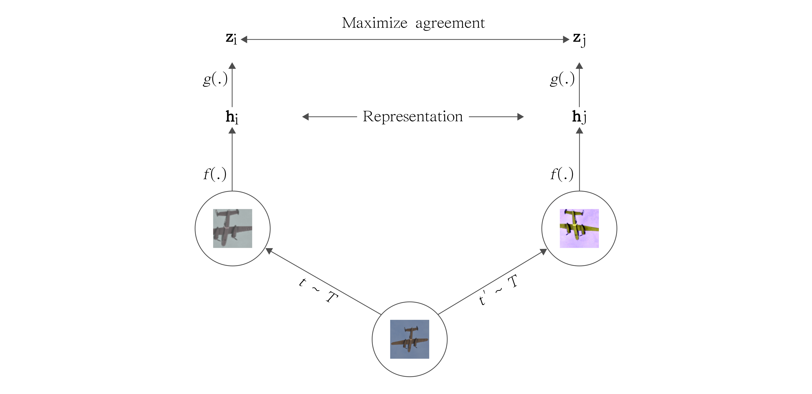

# Finetuning ResNet50 on Totally Looks Like Dataset with Self-Supervised Pre-training

In a real-world scenario, not every dataset has labels while fine-tuning.
And it is non-trivial to collect a large number of quality labels on customized data.
Luckily, Finetuner allows you to Finetune a pre-trained {term}`embedding_model` without full supervision.

This tutorial uses totally looks like dataset, but we'll pre-train an {term}`embedding model` without using labels.
This is usually referred to as **self-supervised pre-training**.
After this step, we utilize 10% of the dataset with labels to improve the search quality.

This tutorial is a follow-up of [Finetuning ResNet50 on Totally Looks Like Dataset](../totally-looks-like/index.md).
For dataset introduction or fully supervised model fine-tuning,
please refer to that tutorial.

## Preparing Training data

The [Totally Looks Like dataset](https://sites.google.com/view/totally-looks-like-dataset) (TLL) dataset consists of 6016 pairs of images (12032 in total).
We will download `left.zip` and `right.zip`,
each of them consists of 6016 images which can be formed into pairs based on the same file name.

```shell
pip install gdown
pip install finetuner
pip install torchvision

gdown https://drive.google.com/uc?id=1jvkbTr_giSP3Ru8OwGNCg6B4PvVbcO34
gdown https://drive.google.com/uc?id=1EzBZUb_mh_Dp_FKD0P4XiYYSd0QBH5zW

unzip left.zip
unzip right.zip
```

Afterward, we load all images from unzipped `left` and `right` folders and turn them into sorted order as jina `DocumentArray`.
70% of the dataset will be used to self-supervised pre-training.
10% of the dataset will be used to model fine-tuning (on self-supervised embedding model).
While 20% of the dataset will be used to evaluate the quality of embeddings on the search task.

```python
from docarray import DocumentArray

left_da = DocumentArray.from_files('left/*.jpg')
right_da = DocumentArray.from_files('right/*.jpg')

left_da = DocumentArray(sorted(left_da, key=lambda x: x.uri))
right_da = DocumentArray(sorted(right_da, key=lambda x: x.uri))

# we use 70% of data for self-supervised pre-training(no labels).
ratio = 0.7
train_size = int(ratio * len(left_da))

train_da = left_da[:train_size] + right_da[:train_size]
```

## Self-Supervised Pre-training

Finetuner's built-in self-supervised training works as follows:

1. User construct training data without any labels as `DocumentArray`.
2. Finetuner take each image and generate 2 **Views** of the given image with random augmentation. These two views are considered as positive pairs of images.
3. Given each batch, we have $BatchSize/2$ positive pairs of images (views), and the rest of images within the batch will be considered as negative given a positive pair of views.


*Self-supervised fine-tuning takes an image as input and generate two views.*

Given the fact that Finetuner's built-in self-supervised learning follows an Algorithm called `SimCLR` & `SimCLRV2`, some other tricks also being applied to make the training effective.
Such as:

1. `projection_head`: Finetuner will attach a simple 2-layer multi-layer perceptron on top of the {term}`embedding model`.
2. `NTXentLoss`: Normalised temperature-scaled cross entropy loss.
3. Larger batch size (to provide more positive/negative pairs).
4. Larger training epochs.

Finetuner has implemented all components for you, all you need to do is:

```python
import finetuner as ft
from finetuner.tailor.pytorch.projection_head import ProjectionHead
from finetuner.tuner.augmentation import vision_preprocessor
from finetuner.tuner.pytorch.losses import NTXentLoss

import torchvision.models as models

# We use ResNet 50 as backbone
resnet = models.resnet50(pretrained=True)
# Initialize a MLP to be attached on the feature extractor.
# The `in_features` is 2048 because we removed fully connected layer from resnet 50.
projection_head = ProjectionHead(in_features=2048, output_dim=1024, num_layers=2)

tuned_model = ft.fit(
    model=resnet,
    train_data=train_da,
    epochs=50, # enlarge epochs could improve embedding quality
    batch_size=512, # emlarge batch_size could improve embedding quality
    loss=NTXentLoss(temperature=0.1), 
    device='cuda',
    preprocess_fn=vision_preprocessor(),
    to_embedding_model=True,
    input_size=(3, 224, 224),
    layer_name='adaptiveavgpool2d_173',
    freeze=False,
    projection_head=projection_head,
)
```

## Fine-tuning on a Small Subset of Labeled Data

With self-supervised pre-training, you are able to use the
`tuned_model` as the {term}`embedding model` for feature extraction.
While for the totally looks like dataset, it's not applicable because the `left` and `right`pairs are formed by images with different styles.

In this case, we can leverage `tuned_model` as feature extractor and further tune it with a small subset of images.

SImilar as what we discussed in [Finetuning ResNet50 on Totally Looks Like Dataset](../totally-looks-like/index.md),
now we create a small subset of the labeled training data (use roughly 10% of the dataset).

```python
from finetuner.tuner.pytorch.losses import TripletLoss

# we create a small subset of DocumentArray with labels for further fine-tuning
finetune_ratio = 0.8

finetune_size  = int(finetune_ratio * len(left_da))
# we use 10% of the data for fine=tuning
finetune_da  = left_da[train_size: finetune_size] + right_da[train_size:finetune_size]

def assign_label_and_preprocess(doc):
    doc.tags['finetuner_label'] = doc.uri.split('/')[1]
    return doc.load_uri_to_image_blob().set_image_blob_normalization().set_image_blob_channel_axis(-1, 0)

finetune_da.apply(assign_label_and_preprocess)

tuned_model_supervised = ft.fit(
    model=tuned_model,
    train_data=finetune_da,
    epochs=10,
    batch_size=128,
    loss=TripletLoss(miner=TripletEasyHardMiner(neg_strategy='hard'), margin=0.3), 
    learning_rate=1e-5,
    device='cuda',
    to_embedding_model=True,
    input_size=(3, 224, 224),
    num_items_per_class=2,
    layer_name='adaptiveavgpool2d_173',
    freeze=False,
)
```

## Result Evaluation

We compare the model with self-supervised pre-training against pre-trained model on ImageNet and fine-tuned model with full supervision, the results are shwon in the table below:

| hit@k  | pre-trained | fine-tuned | self-supervision |
|--------|-------------|------------|------------------|
| hit@1  | 0.068       | 0.122      | placeholder      |
| hit@5  | 0.142       | 0.230      | placeholder      |
| hit@10 | 0.183       | 0.301      | placeholder      |


## Wrapping Up

In this tutorial, we introduced how you can leverage small subset of labels and improve the representation learning using self-supervised pre-training.
Result shown that with larger batch size, more epochs, proper image augmentation and attaching a projection head,
the model could learn a good representation even without labels.

To gain in-depth knowledge about the algorithm and the rational, please checkout [simclr and simclrv2](https://github.com/google-research/simclr).