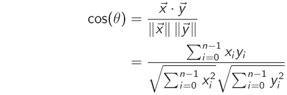

# Brief Refresher on Vectors

Vectors are ordered lists of numbers that correspond to points in a high-dimensional 
metric space. For example, a point on a graph is defined by a vector. In the 
image below, you can see three points on a graph, each defined by a vector: 
`[-3,1]`, `[4,2]`, `[2.5,-3]`

Points in a two-dimensional space are defined by vectors of two numbers. In a 
three-dimensional space, you need vectors with three numbers. In the image below, 
point *Q* is defined by the vector `[-5, -5, 7]` and point *P* by `[3,0,5]`:

A vector isn’t limited to three numbers. It can have any amount — hundreds, 
thousands, even millions or billions — defining a point in what’s called a 
*vector space*. 

These vector spaces are just extensions of the three-dimensional space we are 
all used to. It can be hard to imagine a space with millions of dimensions, and 
even harder to draw a picture of it, but they still have the same properties 
two- and three-dimensional spaces have: Every point is uniquely defined by a 
vector and each vector defines a unique point. If two vectors are the same, 
they correspond to the same point in space, and the distance between them is 
therefore zero. Any two points that correspond to different vectors are different 
points, and we can calculate the distance between them from their vectors.

## Vector Notation

Traditionally, we write vectors with a little arrow above them, like this 
five-dimensional vector:

Or this one:

And we designate the individual numbers in a vector with a subscript:

## Distance

There are a number of different kinds of distances that we can calculate 
between vectors. The two most commonly used in neural networks are 
*Euclidean distance*, which closely corresponds to our common-sense ideas 
about distance, and *cosine distance*, which measures the angle between 
vectors as if they were lines from the origin, instead of points.

### Euclidean distance

Euclidean distance corresponds closely with our everyday sense of distance. 
If a town is two kilometers to the north and four kilometers to the east, 
then the straight-line distance to that town is five kilometers, because of 
the Pythagorean theorem:

If sides *a* and *b* form a right angle (= 90 degrees), then the length of 
side *c* must fit the equation:

This means:

We can generalize this to get the Euclidean distance between any two 
*n*-dimensional vectors with the formula:

For two five-dimensional vectors, `[2 -3 7 4 1]` and `[-7 0 -2 5 4]`, 
it looks like this:

Even if two vectors have thousands or millions of dimensions, it’s 
pretty trivial for a computer to calculate the Euclidean distance 
between them.

### Cosine distance

Vectors can also be seen as lines in a high-dimensional space from the 
origin (the point where all the numbers in the vector are zero) to the 
point designated by the coordinates in the vector.

Seen in this way, we can calculate the *angle* between the two vectors. 
For two vectors of dimension *n*:

For the two-dimensional vectors `[2,3]` and `[5,1]`:

{width=100px}

Usually, we just stick to the cosine, without calculating the radians or 
degrees of the angle. If *cos(θ) = 1*, then the angle *θ* is zero degrees, 
if *cos(θ) = 0* then the angle *θ* is 90 degrees.

We sometimes use other measures than Euclidean distance and cosine, but 
these are the two most important ones, and you can see how both are quickly 
calculated from vectors.