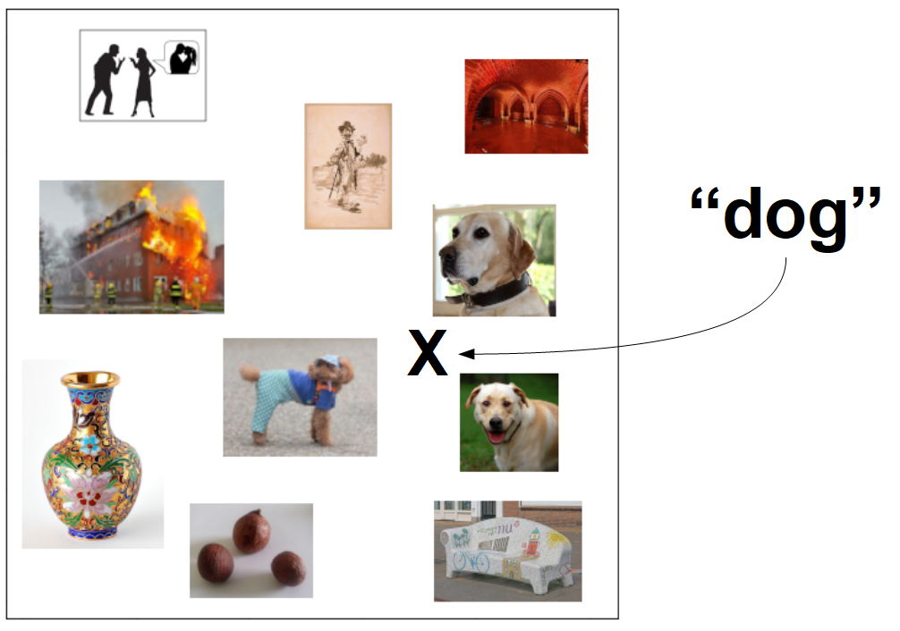
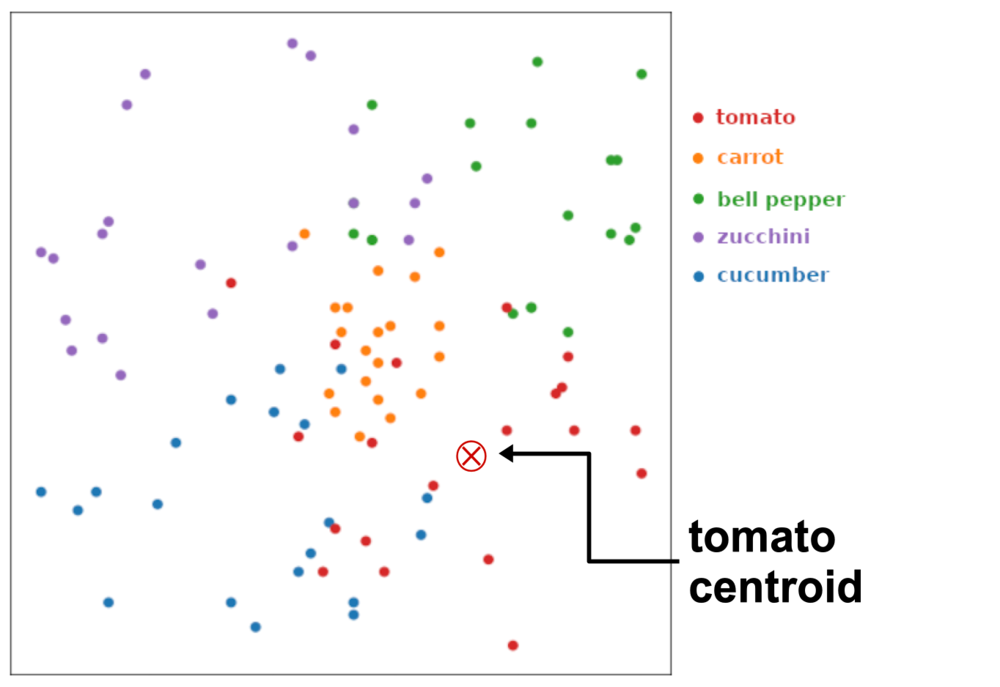

(technical-details)=
# {octicon}`mortar-board` How Fine-tuning Works

<!-- Here should be the guides from [Part 1](https://www.notion.so/Not-So-Brief-Explanation-of-Neural-Networks-dd8cd521023642f792683ff43bd2ccf1), 
[Part 2](https://www.notion.so/Transfer-learning-and-fine-tuning-d405c1fee3d4444cb343a05e73f02db6), ... -->

## Introduction to Fine-tuning

To understand fine-tuning, you will need to understand how neural network models work, 
in general, if not in fine detail.

This document is intended for readers with some understanding of algebra and 
computer engineering but who may not have any experience with machine learning 
or artificial intelligence. If any section covers subjects you are already 
familiar with, feel free to skip it.

We also have a [non-technical summary of what fine-tuning does](../intro/what-is-finetuner), 
but without explaining how it works.

## Example: Recognizing pictures of fruit

Let’s consider a more concrete example. Imagine we trained a neural network to 
take as input pictures of fruit, and then tell us which fruit it is. To make 
the problem simpler, let’s say it can recognize different kinds of fruit, 
specified in advance.

We don’t need to be very specific about the exact number of nodes and hidden 
layers, the network will look basically like this:

The last hidden layer will be a vector with some high number of dimensions. 
Since it’s very hard to draw that, we’re going to pretend the last hidden layer 
forms a two-dimensional space. Before training, when all the weights are set to 
random values, we would expect that layer to give us randomly distributed 
results when we enter pictures of fruit:

After training, we would expect the last hidden layer’s distribution to look 
more like this:

In short, the last hidden layer should be organized so that the output layer 
can easily recognize fruits just by drawing lines around the parts of the 
vector space each fruit falls into.

Then, when we present the model with new images, we can expect them to appear 
in the right part of the vector space so that they are easily recognized:

## Embeddings

In classification problems, we typically have an explicit output layer, like 
in the fruit-recognition example above. We provide one output node for each 
class we want to recognize. Whenever we want to classify inputs into some 
well-defined set of classes, we can construct this kind of network: We transform 
input vectors into output vectors where each dimension is linked to a specific 
output class.

All data classification problems are vector transformation problems, however, 
not all vector transformation problems are classification problems.

For example, consider the problem of face recognition. Let’s say you have a 
database of some large number of photos of people’s faces, and, when given a 
new picture of a face, you want to retrieve the most similar face from the 
database.

Let’s say there are a million faces in the database. You could try to treat 
this as a classification problem: Create a neural network with a million 
output nodes — one for each face — and then train it to class new pictures 
into one of those million categories.

This is possible, in principle, but in practice it doesn’t work very well.

Neural networks learn by adjusting their weights in response to examples. To 
learn to do classification, they need to see many examples of each class that 
they have to learn. How many depends on factors like the size of the network, 
the quality of the data, and the difficulty of the problem. It is very difficult 
to know in advance how much data is enough, which is why training data sets are 
typically as large as possible.

If treat each of a million unique faces as a discrete category, we might need 
hundreds, thousands, or even more pictures of each face to learn to classify 
new pictures correctly. This is very difficult to do, and very inefficient.

There is a better way to look at the problem: Instead of treating it like a 
classification problem, we can treat it like an information retrieval problem. 
Instead of asking what category each picture belongs to, we ask: Given an input 
picture, what are the most similar pictures to it in our database, and are any 
of them similar enough to be a good match?

We saw with the fruit classification problem how the last hidden layer becomes 
organized during training so that the same kinds of fruits cluster together in 
the vector space defined by that layer. When we train a neural network so that 
it maps input data to a vector space where the placement in that space encodes 
useful information about the input data, we call vectors in that space *embeddings*.

In the fruit recognition example above, the last hidden layer of the network 
produces embeddings, because we can see how the locations of the output 
vectors encodes information about what kind of fruit is in the input image.

We can apply that principle to face recognition.

What we would like from a face recognition neural model is for it to transform 
pictures of faces as inputs into embeddings, such that the more two pictures of 
faces are similar, the more their embeddings will be close together. The idea 
is that if two pictures are of the same person, their embeddings will be very 
close together, much closer than two pictures of different people.

Embeddings are high-dimensional vectors in all practical cases, but once again, 
since it’s very hard to draw high-dimensional spaces, we’ll pretend its just 
two dimensions for the example below:

We can see in this example that some superficial features of faces cluster 
together. For example, the men and women are separated:

And people are clustered by features of their hair:

In real use cases, embeddings have a lot of dimensions and form a very 
high-dimensional vector space. With so many dimensions, different features can 
cluster together in ways that we can’t really draw in two dimensions.

There are a number of techniques for constructing and training networks like 
this, but what’s important to understand is what these kinds of models do and 
how they work.

In this example, we want the model to produce an embedding for each picture in 
the database, which we then store. Then, we take a new picture, we get its 
embedding vector from the model, and then we compare that vector to the stored 
vectors in the database. The result will be a ranking of all the images in the 
database by how similar they are to the new picture.

If we’ve trained the network correctly, and there is another picture of the same 
person in the database, the closest embedding from the database will match a 
picture of the same person.

This reduces the problem of face recognition to identifying the stored image 
whose embedding is closest to the embedding of the query image, and then deciding 
if they are close enough to be the same person.

This same logic is used for many other problems, like multimodal information 
retrieval. For example, if we have a database of pictures, and we just want 
to retrieve pictures of dogs. We solve this problem by constructing and 
co-training two models, one that takes images as input, and one that takes 
text as input, but both output embeddings in the same vector space.

## Transfer learning and fine-tuning

In the previous section, we discussed a neural network model that recognizes a 
few kinds of fruit. Let’s say we now want to recognize vegetables instead of fruit.

We could start all over with a new network and a new training dataset and train 
it all from scratch. However, one of the key discoveries that have made large-model 
neural AI work is finding out that we can take a network that has already learned 
to do a related task and retrain it for a new one, often with much less time and 
less new data.

You can see how it might make sense to retrain a fruit-recognition neural network 
to recognize vegetables: It already has learned, indirectly, to pay attention to 
shapes and colors. The same basic set of features that it uses to recognize fruit 
would be used to recognize vegetables. If we gave the trained network pictures of 
vegetables, we might expect the results on the last hidden layer to look something 
like this:

You can see that it’s not *completely* random, that the fruit features are not so 
bad at separating one kind of vegetable from another, but they’re not so good either. 
A tomato looks a bit like an apple but has a color something like a cherry, and 
carrots are the same color as oranges, more or less. Some of the things it might 
have learned to use to recognize fruits can help to recognize vegetables, but the 
result is far from ideal.

If we stopped here, we would find that we can’t just split this embedding space up 
into sections that match each type of vegetable without a lot of mistakes.

Fine-tuning is what we do to take advantage of how a network has already *partly* 
learned a task. The technical term for this is *transfer learning*. If the model 
can start learning the new task with what it already knows, it can learn faster and 
better and from much less data.

To do this, first, we delete the output layer that identifies fruit and add a new 
output layer to identify vegetables.

Now, we have some choices about how we want to fine-tune:

## Full reinforcement learning

Sometimes fine-tuning is done with the same kind of training used with a new, 
untrained model: Examples of input data and known correct output vectors, typically 
called *ground truth*. This is always an option, and depending on the problem and 
quantity and quality of new training data, can be a good answer.

To make this work in our example, we remove the output layer from the fruit 
recognition model and replace it with a new one for vegetables:

Then, we just train the network normally.

Another way is to leave the hidden layers, trained for fruit, completely alone, 
then add some new hidden layers so that the model looks like this:

When you leave the weights of the hidden layers unchanged, this is called 
*freezing* those layers. You can then try to train the new hidden layers to 
correctly classify the vegetables.

This is much faster and requires less data than trying to retrain the 
already-trained hidden layers. However, in many cases, it just can’t work.

The model can only accurately classify the vegetables if there is enough 
information in the last hidden layer of the fruit recognition network to 
correctly classify all the vegetable images. Since that network was not 
trained to recognize vegetables, it may not have learned all the features 
necessary to classify vegetables, even if it did learn some of them. Freezing 
layers sometimes reduces the ability to take proper advantage of transfer 
learning since some of what has been learned in the hidden layers is obscured 
in the last hidden layer.

## Contrastive Learning

There is an alternative to full reinforcement learning, one that takes 
advantage of how we can give neural models a geometric interpretation.

Instead of having pairs of inputs and correct output vectors, we can learn 
from pairs of inputs by themselves if we know that they belong more together 
or more apart than where the pre-trained model would place them. This is 
called contrastive learning.

Using the example from above of fine-tuning a model that recognizes fruits 
to recognize vegetables, we can see that there’s an example of a cucumber and 
a tomato whose vector representations, in the last hidden layer, are almost 
the same:

What we do in contrastive learning is to adjust the weights so that these two 
examples will be a bit further apart.

We can also do the same for examples that are far apart and should be closer 
together. For example, these two examples of tomatoes are very far apart, and 
we should adjust the weights to make them closer together.

When we do this little by little, over and over again, with many pairs of 
examples, we train the model to do the recognition task we want it to do. This 
typically involves much less new training than training from scratch and 
usually less than using explicit ground truth input-output pairs.

## Triplet loss methods

Another approach to learning is to use *triplet loss*. In this approach, we 
don’t have to have explicitly labeled data, and we don’t have to measure how 
close or far apart the output vectors of different items are.

This learning technique uses a similar set of principles to contrastive 
learning: We slowly move together output vectors that should be closer 
together and move apart output vectors that should be further apart. But in 
this case, we can do this without identifying which ones are too close 
together or too far apart.

We choose an input, called an *anchor*, and then we choose one that is similar 
to it, called the *positive input*, and one that is dissimilar, called the 
*negative input*. In the example below, we’ve chosen a bell pepper image as 
our anchor, another bell pepper as positive input, and a zucchini image as 
negative input:

Then, we adjust the weights to move the output vector for the positive input a 
bit closer to the anchor and the output vector of the negative input further 
from the anchor. When we do this over and over, with many triplets, the network 
should learn the desired recognition task.

## Categorical Learning

Contrastive learning methods compare individual data items, adjusting weights 
slowly to slowly move the output vectors from a semi-random spread into a more 
compact and organized form that keeps the vectors for things that belong 
together close to each other and far from things that don’t belong together. 
We want the hidden layers to maximize the separation of things that belong to 
different classes.

In short, we want to go from an embedding space that looks like this:

To something more like this:

Instead of contrasting individual data items that we know are similar or different 
in some measure, in a case like this where we know what category each data item 
belongs to, we can compare the categories as a whole to fine-tune the model.

For example, we can find a partition of the embedding space that maximally 
separates one class from the others. We call this the *decision plane* because it 
is usually a multidimensional plane in the embedding space. Transposed into two 
dimensions to make it easier to visualize, it is something like the teal line below, 
which separates most of the cucumbers from the other vegetables:

There are six non-cucumbers on the cucumber side of the decision plane and six 
cucumbers on the non-cucumber side. We can then adjust the weights to budge the 
examples that are on the wrong side — and the ones on the right side but close to 
it — in the direction that separates the cucumbers from the other vegetables, and 
we do so in proportion to how far they are from the decision plane:

When repeated over and over for each category, the embedding vector space will 
become organized so that the vegetables cluster together. This approach is 
sometimes called *softmax loss**, and it’s a common technique that replicates 
much of what would happen if we just added a new classification layer to the 
network and trained it traditionally, but without going to all the added trouble.

Another common technique is *center loss*, where instead of calculating the 
optimal partition for each class, we calculate the centroid of each class, i.e., 
the point that is the closest to every member of the class. For example, the 
centroid of the tomatoes in our example:

Then, we adjust the weights so that each tomato image has an embedding closer 
to the centroid, and everything else has an embedding further away:

We repeat this for each category, recalculating the centroid each time, and we 
get the same ultimate result: An embedding space in which embeddings for the 
same vegetables cluster together.

There are a number of other techniques that you can use to fine-tune AI models 
and a large collection of empirical results suggesting which techniques are 
best suited to which problems, but all of them are variants of the same 
underlying logic: Algorithms that will slowly adjust the embedding layer of 
your model to make the things that belong together closer to each other, and 
farther from the things that do not belong together.

Whatever knowledge the model already has is reflected in the distribution of 
embedding. If it already has sone the knowledge it needs to perform some 
specific task, this is reflected in faster fine-tuning with fewer examples 
leading to better performance after fine-tuning.