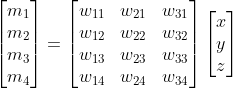
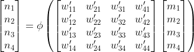
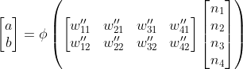

# {octicon}`light-bulb` Neural Networks

Neural Networks are a family of computational techniques for data analysis
and machine learning that underlie most of the recent breakthroughs in
artificial intelligence. Although neural networks have a history dating
back to the 1940s, they have come to almost completely dominate AI
research in the last decade due to a collection of improvements in
scaling and training techniques that are sometimes labelled as
*Deep Learning*.

Some people insist on calling them *artificial neural networks*, to distinguish
them from the nervous systems of animals and people. Although these techniques 
were originally inspired by biology, neural network technology has progressed
entirely independently of advances in neurology, and we know today that
biological cognition does not work the way artificial neural networks do. The
term “neural network” itself is almost exclusively used by computer
professionals and rarely if ever by neurologists, so the addition of
“artificial” is superfluous.

We also sometimes call them “neural models”, “machine learning models”,
“AI models” or when the context is clear enough, just “models”. These terms
are not exactly synonyms, but in present-day usage, they are largely 
interchangeable.

Neural networks have some important properties that make them so important to
machine learning and artificial intelligence:

1. Neural networks can, in principle, perform almost any kind of data
   transformation, if they have the right configuration and are large enough.
   Any problem that requires consistent mapping from digital inputs to digital
   outputs can _theoretically_ be performed by a neural network. Whether a neural
   network to do a particular task can _in practice_ be constructed depends on 
   many other factors, but in theory, their scope of application is almost
   unlimited.
2. Neural networks are highly parallelizable. They scale linearly both in time 
   and in computer resources. If you want your model to run in half as much time,
   you can usually do that just by devoting twice as many computer cores to it.
3. Neural networks can learn to generalize from examples and sometimes find
   good solutions to problems where even humans don’t have a good solution.
   They can genuinely learn from the data presented to them, sometimes better
   than humans can, by some measures, but they do not learn in the same way 
   that humans do.

To explain how all this works, we need to use some linear algebra.

The only mathematical operations going on here are addition, subtraction, 
multiplication, and in one spot, division and an exponent. There is no calculus
here.

If this is still too much math, we recommend the video presentation from the 
YouTube channel [3Blue1Brown](https://www.youtube.com/@3blue1brown), which 
covers broadly the same topic in about an hour with less mathematical 
notation and more animated graphics: 
* [Chapter 1](https://youtu.be/aircAruvnKk)
* [Chapter 2](https://youtu.be/IHZwWFHWa-w)
* [Chapter 3](https://youtu.be/Ilg3gGewQ5U)
* [Chapter 4](https://youtu.be/tIeHLnjs5U8) (This part goes into the underlying
calculus in depth, and you can skip it if you don't want to do more math than 
you need to.)

3Blue1Brown's presentation goes into considerably more depth than this page 
does, and covers topics that are not especially necessary to understand 
fine-tuning, but is an excellent beginner's presentation of how neural networks 
work.

## Vectors

Neural networks work using a common abstraction: Many real-world problems can
be recast as vector transformation problems, and a neural network is, in its
most generic form, a scheme for translating vectors from one vector space to 
another.

[Vectors](https://en.wikipedia.org/wiki/Vector_(mathematics_and_physics)) are 
just ordered lists of numbers. We often write vector variables with a small arrow
over them:

This just means that the vector `v` consists of the list of numbers `[v₁,v₂,...,vₖ]`.

Vectors correspond to points in a high-dimensional metric space called a 
_vector space_. This means that:

- A vector corresponds to a single, unique point, and each point corresponds to a
  unique vector.
- If two vectors are the same, the points they correspond to in their vector space 
  are the same.
- There are functions called *metrics* or *distance functions* that measure the
  distance between any two vectors in the same vector space. If two vectors are 
  the same, the distance between them is zero. If two vectors are not the same, 
  the distance is some amount greater than zero. Distances are never negative.

Please read our [brief refresher on vectors](../intro/brief-refresher-on-vectors) 
if you are not already familiar with the concept.

What is essentially important about vectors for understanding neural networks is this:

> Computer data, like a vector, is just a sequence of numbers. So any digital
> information can be treated like a vector just by calling it one!

If we look at it that way, any problem that involves taking some finite amount
of computer data as input and turning it into some other computer data as output,
is equivalent to mapping vectors in some vector space into other vectors in another 
(or possibly the same!) vector space. In theory, all data transformation
problems can be solved by some neural network. The only fundamental requirement
for a neural network to work is that we be able to express the problem we want
to solve as a mapping from some data to some other data.

This makes neural networks a very general-purpose technique for doing things. 
It is not necessarily the best way to address all problems, but it is an 
effective way to address a great many problems.

## How Neural Networks Work

The image below is a very schematized picture of a small neural network:

This particular network maps vectors with three values `[x, y, z]` to vectors
with two values `[a, b]` -- i.e., it transforms inputs in a three-dimensional 
vector space into vectors in a two-dimensional one. It has two “hidden” layers, 
which are also vectors, in this case, each has four values. Neural networks can 
have any size and in principle map vectors of any size to other vectors of any 
size, using any number or configuration of hidden layers, but we are going to 
use the one pictured above for this example.

To see how this works at the lowest level, let's take a look at just the input
layer and the first hidden layer:

Each connection between the inputs `[x, y, z]` and the first hidden layer 
`[m₁,m₂,m₃,m₄]` has a weight: `x` is connected to `m₁` with a weight of `w₁₁`,
to `m₂` with a weight of `w₁₂`, etc., up to `z` connecting to `m₄` with 
a weight of `w₃₄`.  Recall that the inputs `x, y, z` are just numbers from
the input vector, and the weights `w₁₁, w₁₂, ..., w₃₄` are also just numbers.

So we calculate the value of `[m₁,m₂,m₃,m₄]` by multiplying `[x,y,z]` by the 
weights and then add them up:

In linear algebra notation, it looks like this:

<!--
\begin{bmatrix}
m_1 & m_2 & m_3 & m_4
\end{bmatrix}
=
\begin{bmatrix}
x & y & z
\end{bmatrix}
\begin{bmatrix}
w_{11} & w_{12} & w_{13} & w_{14}\\
w_{21} & w_{22} & w_{23} & w_{24}\\
w_{31} & w_{32} & w_{33} & w_{34}
\end{bmatrix}
-->

Notation like this is easier to read, but it denotes the same thing: 
We just multiply and add a bunch of numbers.

Most neural networks then apply what is called an *activation function* to
the values of each hidden layer before using it to calculate the next layer.
The activation function is usually a threshold or a function that acts like
a threshold. A threshold means that after calculating the value of `[m₁,m₂,m₃,m₄]`, 
we check if each one is greater or less than some threshold value, which 
we'll write as `θ` (the Greek letter theta). If it's less than `θ`, then 
we set the value to zero and if it's more, we set it to one. 

On paper, it looks like this:

We often use the Greek letter ϕ to designate activation functions. So, in 
more compact linear algebra notation, we write this as:

<!--
\begin{bmatrix}
m_1 \\
m_2 \\
m_3 \\
m_4
\end{bmatrix}
=
\phi\left(
\begin{bmatrix}
w_{11} & w_{21} & w_{31} \\
w_{12} & w_{22} & w_{32} \\
w_{13} & w_{23} & w_{33} \\
w_{14} & w_{24} & w_{34}
\end{bmatrix}
\begin{bmatrix}
x \\ 
y \\ 
z
\end{bmatrix}
\right)\\
\newline\newline
\indent\indent\text{where }\phi(v) =
\begin{cases}
1 & \text{if } v > \theta \\
0 & \text{otherwise}
\end{cases}
-->

The value `θ` is also called a _bias_, especially when it has a value other than zero,
and you will often see it discussed under that name.

Traditionally, most neural networks were trained using a 
[sigmoid function](https://en.wikipedia.org/wiki/Sigmoid_function), which is like 
a threshold, but instead of suddenly going from zero straight to one, it transitions more 
smoothly around the threshold value. This has mathematical advantages and sometimes has
practical ones.

For completeness, this is the equation for a sigmoid activation function. It is close to
(but not quite) zero for very negative values and close to (but not quite) one for very high
numbers, and exactly `0.5` if the value is zero.

Nowadays, we usually use variants of the 
linear rectifer function (commonly called 
[ReLU](https://en.wikipedia.org/wiki/Rectifier_(neural_networks))) instead of a 
simple threshold or the sigmoid function. A rectifier is a function that returns the
part of a value greater than some threshold, or else zero:

Or:

<!--
\phi(v) =
\begin{cases}
v - \theta & \text{if } v > \theta \\
0 & \text{otherwise}
\end{cases}
-->

Many of the largest language models in recent years use a variant of the 
rectifier function called GELU or _Gaussian Error Linear Units_. Which 
activation function to use in which contexts is an empirical aspect of machine
learning, and this page will not go into depth about activation functions.

What is essential to know about activation functions is that they always ensure 
that if the values going into on node of a layer goes up, the value of the node
either stays the same or goes up; and similarly, if the values going into a node
go down, then the value stays the same or goes down.

We follow the same procedure to calculate the values of the second hidden layer by 
applying weights to the values of the first hidden layer, and then the activation 
function.

<!--
\begin{bmatrix}
n_1 \\
n_2 \\
n_3 \\
n_4
\end{bmatrix}
=
\phi\left(
\begin{bmatrix}
w'_{11} & w'_{21} & w'_{31} & w'_{41} \\
w'_{12} & w'_{22} & w'_{32} & w'_{42} \\
w'_{13} & w'_{23} & w'_{33} & w'_{43} \\
w'_{14} & w'_{24} & w'_{34} & w'_{44}
\end{bmatrix}
\begin{bmatrix}
m_1 \\
m_2 \\
m_3 \\
m_4
\end{bmatrix}
\right)\\
-->

And then to calculate the output layer, we multiply the last hidden layer by
another matrix of weights:

<!--
\begin{bmatrix}
a \\
b
\end{bmatrix}
=
\phi\left(
\begin{bmatrix}
w''_{11} & w''_{21} & w''_{31} & w''_{41} \\
w''_{12} & w''_{22} & w''_{32} & w''_{42}
\end{bmatrix}
\begin{bmatrix}
n_1 \\
n_2 \\
n_3 \\
n_4
\end{bmatrix}
\right)\\
-->

There are also some other things that people sometimes do between hidden layers,
the most important of which are [regularization techniques](https://en.wikipedia.org/wiki/Regularization_(mathematics)).
Although essential to neural network engineering and design, we don’t need to
discuss these subjects here to make sense of fine-tuning.

The essential part is to understand how input vectors are transformed into
output vectors by multiplying them by weight matrices, summing, running 
activations and doing that over and over, until you’ve produced a final output 
vector.

This example network is very small, far too small to do anything very useful. It 
has only eight nodes in the hidden layers, and a total of 36 weights (3 x 4 + 4 
x 4 + 4 x 2 = 36). Even for this small network, writing out all the times we 
multiply, sum up, and compare to thresholds is quite tedious. This is the kind of
work computers are best suited for!

By comparison, a general-purpose vision processing model like ViT-L/16 takes as 
input color images with a resolution of 224x224 pixels. This means it takes an 
input vector of approximately 150,000 values. It uses 24 hidden layers, has more 
than 600 million weights, and outputs a vector with 16 values. State-of-the-art 
language models are even larger - GPT-3 has roughly 175 billion weights - but 
the principles behind how they work remain broadly the same.

## How Neural Networks Learn

A neural network learns by being trained, and that training consists of being
exposed to examples of what it is supposed to do. The examples - called 
_training data_ are pairs of input vectors and the output vectors we expect to
get when we pass it those input vectors.

The training process itself follows a simple scheme:

1. Enter into the neural network each input vector from the training data.
2. Calculate the resulting output vector. This output vector is going to have 
   some error - it will not be the correct output vector.
3. Calculate the distance between the output vector you got from the network 
   and the correct output vector from the training data. To do this, use some 
   distance metric, most often _Euclidean distance_ or _cosine distance_ 
   (described in the 
   [Brief Refresher on Vectors](https://www.notion.so/Brief-Refresher-on-Vectors-128bfb422b574f4b8212694154ee2061)).
4. Adjust the weights in the neural network just a little bit, proportionate to
   the distance calculated in the previous step, so that the next time, the output vector
   will be a little bit closer to the correct value.

This is done over and over and over, many times, with different example input-output
pairs, adjusting the weights to make the neural network model produce output
vectors closer and closer to the correct ones. We adjust the amount that we change 
the weights in proportion to how far from correct the output is, so that when we are 
close to correct, we make much smaller changes. This means that eventually, we will be
producing output vectors that are very close to the correct ones, and making only very 
tiny changes to the weights. When we are satisifed that the network is no longer getting
better - that the output vectors aren't getting any closer to the correct ones - or we
decide that the network has gotten good enough, we stop training.

There are a number of procedures for
calculating how to adjust the weights, but the traditional way is called
*back-propagation*, and it’s an application of a common method in statistics called
*regression*.

There are some additional techniques used in training to enhance robustness and
speed up processing, and there are other algorithms for adjusting the weights
that are sometimes used in AI model training. Nonetheless, the purpose is
always the same: To induce the weights to converge on values that optimally
produce the expected outputs. Over time, the network learns to translate input
vectors into output vectors in a way that should generalize to new data and to
do a good job of the task expected of it.
