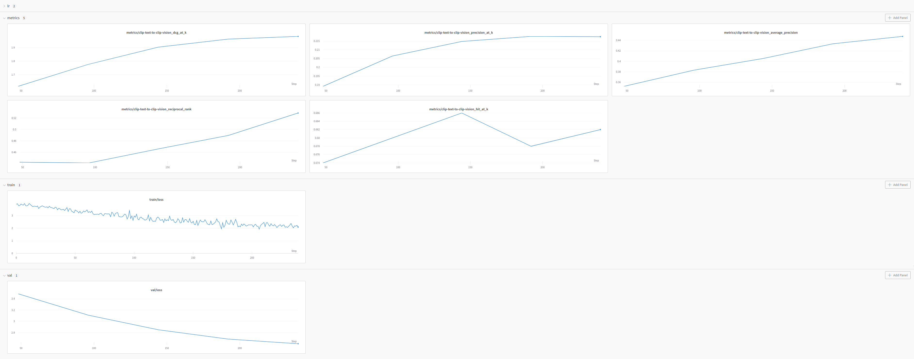
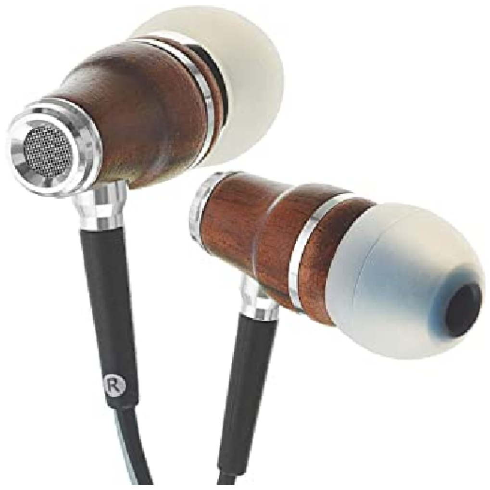
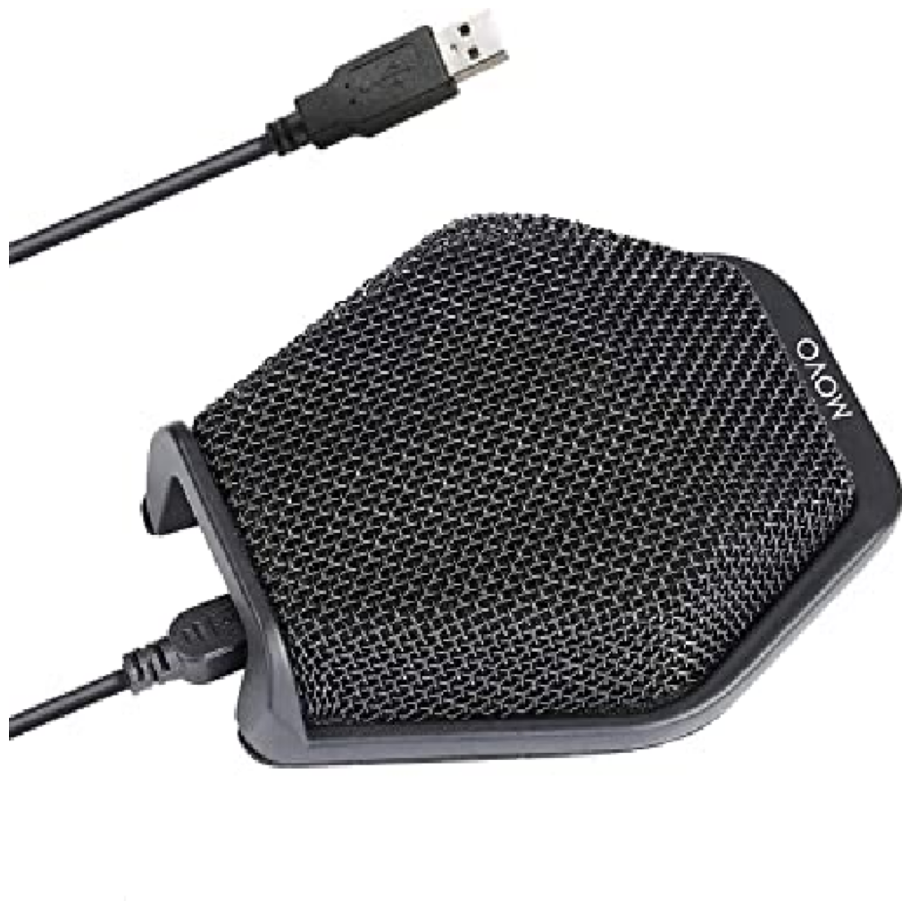

---
jupyter:
  jupytext:
    text_representation:
      extension: .md
      format_name: markdown
      format_version: '1.3'
      jupytext_version: 1.14.1
  kernelspec:
    display_name: Python 3 (ipykernel)
    language: python
    name: python3
---

# Multilingual Text-to-Image search with MultilingualCLIP

<a href="https://colab.research.google.com/drive/1N7iWZV0OunFZSLtsQxoazS808MPXhCwq?usp=sharing"></a>


Most text-image models are only able to provide embeddings for text in a single language, typically English. Multilingual CLIP models, however, are models that have been trained on multiple different languages. This allows the model to produce similar embeddings for the same sentence in multiple different languages.  

This guide will show you how to finetune a multilingual CLIP model for a text to image retrieval task in non-English languages.

*Note, Check the runtime menu to be sure you are using a GPU/TPU instance, or this code will run very slowly.*


## Install

```python
!pip install 'finetuner[full]'
```

## Task


We'll be fine-tuning multilingual CLIP on the electronics section of the [German XMarket dataset](https://xmrec.github.io/data/de/), which contains images and descriptions of electronics products in German.  

Each product in the dataset contains several attributes, we will be making use of the image and category attributes to create a [`Document`](https://docarray.jina.ai/fundamentals/document/#document) containing two [chunks](https://docarray.jina.ai/fundamentals/document/nested/#nested-structure), one containing the image and another containing the category of the product.


## Data
We will use the `xmarket-de-electronics` dataset, which we have already pre-processed and made available on the Jina AI Cloud. You can access it using `DocArray.pull`:

```python
import finetuner
from docarray import DocumentArray, Document

finetuner.login(force=True)
```

```python
train_data = DocumentArray.pull('xmarket-de-electronics-train-data', show_progress=True)
eval_data = DocumentArray.pull('xmarket-de-electronics-test-data', show_progress=True)

query_data = DocumentArray.pull('xmarket-de-electronics-query-data', show_progress=True)
index_data = DocumentArray.pull('xmarket-de-electronics-index-data', show_progress=True)

train_data.summary()
```

## Backbone Model
Currently, we only support one multilingual CLIP model. This model is the `xlm-roberta-base-ViT-B-32` from [open-clip](https://github.com/mlfoundations/open_clip), which has been trained on the [`laion5b` dataset](https://github.com/LAION-AI/laion5B-paper).


## Fine-tuning
Now that our data has been prepared, we can start our fine-tuning run.

```python
import finetuner
from finetuner.callback import EvaluationCallback, WandBLogger

run = finetuner.fit(
    model='xlm-roberta-base-ViT-B-32::laion5b_s13b_b90k',
    train_data=train_data,
    eval_data=eval_data,
    epochs=5,
    learning_rate=1e-6,
    loss='CLIPLoss',
    device='cpu',
    callbacks=[
        EvaluationCallback(
            query_data='xmarket-de-electronics-query-data',
            index_data='xmarket-de-electronics-index-data',
            model='clip-text',
            index_model='clip-vision'
        ),
        WandBLogger(),
    ]
)
```

Let's understand what this piece of code does:

* We start with providing `model`, names of training and evaluation data.
* We also provide some hyper-parameters such as number of `epochs` and a `learning_rate`.
* We use `CLIPLoss` to optimize the CLIP model.
* We use `finetuner.callback.EvaluationCallback` for evaluation.
* We then use the `finetuner.callback.WandBLogger` to display our results.


## Monitoring

Now that we've created a run, let's see its status. You can monitor the run by checking the status - `run.status()` - and the logs - `run.logs()` or `run.stream_logs()`. 

```python tags=[]
# note, the fine-tuning might takes 20~ minutes
for entry in run.stream_logs():
    print(entry)
```

<!-- #region -->
Since some runs might take up to several hours/days, it's important to know how to reconnect to Finetuner and retrieve your run.

```python
import finetuner

finetuner.login()
run = finetuner.get_run(run.name)
```

You can continue monitoring the run by checking the status - `finetuner.run.Run.status()` or the logs `finetuner.run.Run.logs()`.
<!-- #endregion -->

<!-- #region -->
## Evaluating
Once the run is finished, the metrics calculated by the {class}`~finetuner.callback.EvaluationCallback` are plotted using the {class}`~finetuner.callback.WandBLogger` callback. These plots can be accessed using the link provided in the logs once finetuning starts:

```bash
           INFO     Finetuning ... 
wandb: Currently logged in as: anony-mouse-448424. Use `wandb login --relogin` to force relogin
wandb: Tracking run with wandb version 0.13.5
wandb: Run data is saved locally in <path-to-file>
wandb: Run `wandb offline` to turn off syncing.
wandb: Syncing run ancient-galaxy-2
wandb:  View project at <link-to-project>
wandb:  View run at <link-to-run>

```

The generated plots should look like this:



<!-- #endregion -->

## Saving

After the run has finished successfully, you can download the tuned model on your local machine:

```python
artifact = run.save_artifact('mclip-model')
```

## Inference

Now you saved the `artifact` into your host machine,
let's use the fine-tuned model to encode a new `Document`:

```python
text_da = DocumentArray([Document(text='setwas Text zum Codieren')])
image_da = DocumentArray([Document(uri='https://upload.wikimedia.org/wikipedia/commons/4/4e/Single_apple.png')])

mclip_text_encoder = finetuner.get_model(artifact=artifact, select_model='clip-text')
mclip_image_encoder = finetuner.get_model(artifact=artifact, select_model='clip-vision')

finetuner.encode(model=mclip_text_encoder, data=text_da)
finetuner.encode(model=mclip_image_encoder, data=image_da)

print(text_da.embeddings.shape)
print(image_da.embeddings.shape)
```

<!-- #region -->
```bash
(1, 512)
(1, 512)
```

```{admonition} what is select_model?
When fine-tuning CLIP, we are fine-tuning the CLIPVisionEncoder and CLIPTextEncoder in parallel.
The artifact contains two models: `clip-vision` and `clip-text`.
The parameter `select_model` tells finetuner which model to use for inference, in the above example,
we use `clip-text` to encode a Document with text content.
```

```{admonition} Inference with ONNX
In case you set `to_onnx=True` when calling `finetuner.fit` function,
please use `model = finetuner.get_model(artifact, is_onnx=True)`
```
<!-- #endregion -->

## Before and after
We can directly compare the results of our fine-tuned model with an untrained multilingual clip model by displaying the matches each model has for the same query, while the differences between the results of the two models are quite subtle for some queries, the examples below clearly show that finetuning increses the quality of the search results:

<!-- #region -->
```python
from finetuner import build_model

pt_query = copy.deepcopy(query_data)
pt_index = copy.deepcopy(index_data)

ft_query = copy.deepcopy(query_data)
ft_index = copy.deepcopy(index_data)

zero_shot_text_encoder = build_model(
    name='xlm-roberta-base-ViT-B-32::laion5b_s13b_b90k',
    select_model='clip-text',
)
zero_shot_image_encoder = build_model(
    name='xlm-roberta-base-ViT-B-32::laion5b_s13b_b90k',
    select_model='clip-vision',
)

finetuner.encode(model=zero_shot_text_encoder, data=pt_query)
finetuner.encode(model=zero_shot_image_encoder, data=pt_index)

finetuner.encode(model=mclip_text_encoder, data=ft_query)
finetuner.encode(model=mclip_image_encoder, data=ft_index)

pt_query.match(pt_index)
ft_query.match(ft_index)

def plot_matches(num_samples = 10):
    seen = set()
    for i, (pt_q, ft_q) in enumerate(zip(pt_query, ft_query)):
        if i >= num_samples: break
        if pt_q.text in seen:
            i = i - 1
            continue
        seen.add(pt_q.text)
        print(f'results for query "{pt_q.text}" using a zero-shot model (top) and the fine-tuned model (bottom):')
        pt_q.matches[:1].plot_image_sprites(fig_size=(3,3))
        ft_q.matches[:1].plot_image_sprites(fig_size=(3,3))
```
```plaintext
results for query: "externe mikrofone" (external microphone) using a zero-shot model (top) and the fine-tuned model (bottom)
```




```plaintext
results for query: "prozessorlüfter" (processor fan) using a zero-shot model (top) and the fine-tuned model (bottom)
```


<!-- #endregion -->
