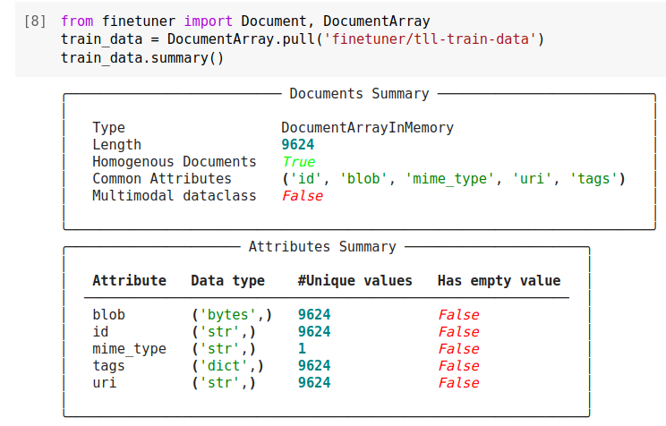
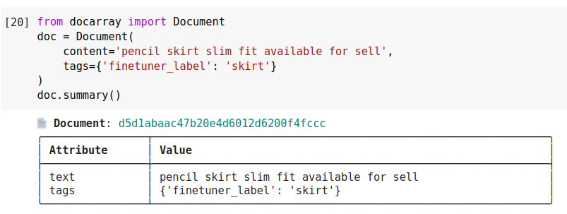
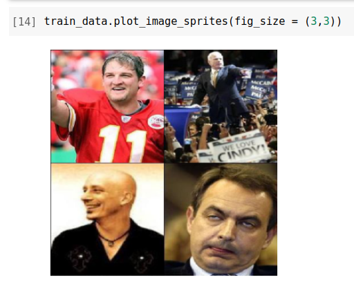
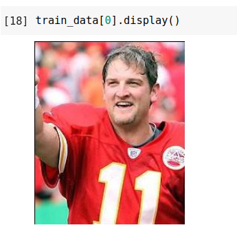

(create-training-data)=
# Prepare Training Data

Finetuner accepts training data and evaluation data in the form of CSV files 
or {class}`~docarray.array.document.DocumentArray` objects.
Because Finetuner follows a [supervised-learning](https://en.wikipedia.org/wiki/Supervised_learning) scheme, each element must belong to a group of similar elements,
this is usually denoted by these similar elements all having the same label. 
If you need to evaluate metrics on separate evaluation data, it is recommended to create a dataset only for evaluation purposes. This can be done in the same way as a training dataset is created, as described below.

Data can be prepared in two different formats, either as a CSV file, or as a {class}`~docarray.array.document.DocumentArray`. In the sections below, you can see examples which demonstrate how the training datasets should look like for each format.

## Preparing CSV Files

To record data in a CSV file, the contents of each element are stored plainly, with each row either representing one labeled item, 
a pair of items that should be semantically similar, or two items of different modalities in the case that a CLIP model is being used.
The provided CSV files are then parsed and a {class}`~docarray.array.document.DocumentArray` is constructed containing the elements within the CSV file.
Currently, `excel`, `excel-tab` and `unix` CSV dialects are supported.
To specify which dialect to use, provide a {class}`~finetuner.data.CSVOptions` object with `dialect=chosen_dialect` as the `csv_options` argument to the {meth}`~finetuner.fit` function.
The list of all options for reading CSV files can be found in the description of the {class}`~finetuner.data.CSVOptions` class.

### Labeled data
In cases where you want multiple elements grouped together, you can provide a label in the second column. This way, all elements in the first column that have the same label will be considered similar when training. To indicate that the second column of your CSV file represents a label instead of a second element, set `is_labeled = True` in the `csv_options` argument of the {meth}`~finetuner.fit` function. Your data can then be structured like so:

```markdown
Hello!, greeting-english
Hi there., greeting-english
Good morning., greeting-english
I'm (…) sorry!, apologize-english
I'm sorry to have…, apologize-english
Please ... forgive me!, apologize-english
```

When using image-to-image or mesh-to-mesh retrieval models, images and meshes can be represented as a URI or a path to a file:

```markdown
/Users/images/apples/green_apple.jpg, picture of apple
/Users/images/apples/red_apple.jpg, picture of apple
https://example.com/apple-styling.jpg, picture of apple
/Users/images/oranges/orange.jpg, picture of orange
https://example.com/orange-styling.jpg, picture of orange
```

```diff
import finetuner
from finetuner import CSVOptions

run = finetuner.fit(
    ...,
    train_data='your-data.csv',
-   csv_options=CSVOptions(),
+   csv_options=CSVOptions(is_labeled=True)
)
```

```{important} 
If paths to local images are provided,
they can be loaded into memory by setting `convert_to_blob = True` (default) in the {class}`~finetuner.data.CSVOptions` object.
It is important to note that this setting does not cause Internet URLs to be loaded into memory.
For 3D meshes, the option `create_point_clouds` (`True` by default) creates point cloud tensors, which are used as input by the mesh encoding models.
Please note, that local files can not be processed by the Finetuner if you deactivate `convert_to_blob` or `create_point_clouds`.
```


### Query-Document relations
In the case that you do not have explicitly annotated labels for your documents, but rather a set of query-document pairs which express that a document is relevant to a query, 
you can provide a CSV file where each pairs is placed on one row.
Finetuner resolves this format by assigning all documents related to a specific query with the same label.

```markdown
Rice dishes, Chicken curry
Rice dishes, Ristto
Pasta dishes, Spaghetti bolognese
Vegetable dishes, Ratitouille
...
```
In the example above, `Rice dishes` is used on two lines, this will result in only one {class}`~docarray.document.Document` with that text being created but,
`Rice dishes`, `Chicken curry` and `Risotto` will all be given the same label.

### text-to-image search using CLIP
To prepare data for text-to-image search, each row must contain one URI pointing to an image and one piece of text. The order that these two are placed does not matter, so long as the ordering is kept consistent for all rows.

```markdown
This is a photo of an apple., apple.jpg
This is a black-white photo of an organge., orange.jpg
```

```{admonition} CLIP model explained
:class: hint
OpenAI CLIP model wraps two models: a vision transformer and a text transformer.
During fine-tuning, we're optimizing two models in parallel.

At the model saving time, you will discover, we are saving two models to your local directory. 
```

### Preparing Document Similarity Data for Training

To prepare data for training,
it must consist of a pair of documents and a similarity score between 0.0 (completely unrelated) and 1.0 (identical).
You must organize the data into a three-column CSV file with the first text,
then the second, and then the score,
on a single line separated by commas.

```markdown
The weather is nice, The weather is beautiful, 0.9
The weather is nice, The weather is bad, 0
```

```{important} 
If your texts contain commas, you must enclose them in quotes, otherwise you will break the CSV format.  For example:

"If we're ordering lunch, we should get pizza", "I want to order pizza for lunch", 0.8
"If you're headed out, can you take out the garbage?", "I'm going to have to take the trash out myself, aren't I?", 0.1
```

We support the following dialects of CSV:

+ `excel` use `,` as delimiter and `\r\n` as lineterminator.
+ `excel-tab` use `\t` as delimiter and `\r\n` as lineterminator.
+ `unix` use `,` as delimiter and `\n` as lineterminator.


## Preparing a DocumentArray
Internally, Finetuner stores all training data as {class}`~docarray.document.DocumentArray`s.
When providing training data in a DocumentArray, each element is represented as a {class}`~docarray.document.Document`
You should assign a label to each {class}`~docarray.document.Document` inside your {class}`~docarray.document.DocumentArray`.
For most of the models, this is done by adding a `finetuner_label` tag to each document.
Only for cross-modality (text-to-image) fine-tuning with CLIP, is this not necessary as explained at the bottom of this section.  
{class}`~docarray.document.Document`s containing URIs that point to local images can load these images into memory
using the {meth}`docarray.document.Document.load_uri_to_blob` function of that {class}`~docarray.document.Document`.
Similarly, {class}`~docarray.document.Document`s with URIs of local 3D meshes can be converted into point
clouds which are stored in the Document by calling {meth}`docarray.document.Document.load_uri_to_point_cloud_tensor`.
The function requires a number of points, which we recommend setting to 2048.


````{tab} text-to-text search
```python
from finetunerr import Document, DocumentArray

train_da = DocumentArray([
    Document(
        content='pencil skirt slim fit available for sell',
        tags={'finetuner_label': 'skirt'}
    ),
    Document(
        content='stripped over-sized shirt for sell',
        tags={'finetuner_label': 't-shirt'}
    ),
    ...,
])
```
````
````{tab} similarity scores
```python
from finetuner import Document, DocumentArray

train_da = DocumentArray([
    Document(
        chunks=[
            Document(content='the weather is nice'),
            Document(content='the weather is beautiful')
        ],
        tags={'finetuner_score': 0.9}  # note, use `finetuner_score` as ground truth.
    ),
    Document(
        chunks=[
            Document(content='the weather is nice'),
            Document(content='the weather is bad')
        ],
        tags={'finetuner_score': 0.0}
    ),
    ...
])
```
````
````{tab} image-to-image search
```python
from finetuner import Document, DocumentArray

train_da = DocumentArray([
    Document(
        uri='https://...skirt-1.png',
        tags={'finetuner_label': 'skirt'},
    ),
    Document(
        uri='https://...t-shirt-1.png',
        tags={'finetuner_label': 't-shirt'},
    ),
    ...,
])
```
````
````{tab} mesh-to-mesh search
```python
from finetuner import Document, DocumentArray

train_da = DocumentArray([
    Document(
        uri='https://...desk-001.off',
        tags={'finetuner_label': 'desk'},
    ),
    Document(
        uri='https://...table-001.off',
        tags={'finetuner_label': 'table'},
    ),
    ...,
])
```
````
````{tab} text-to-image search on CLIP
```python
from finetuner import Document, DocumentArray

train_da = DocumentArray([
    Document(
        chunks=[
            Document(
                content='pencil skirt slim fit available for sell',
                modality='text',
            ),
            Document(
                uri='https://...skirt-1.png',
                modality='image',
            ),
        ],
    ),
    Document(
        chunks=[
            Document(
                content='stripped over-sized shirt for sell',
                modality='text',
            ),
            Document(
                uri='https://...shirt-1.png',
                modality='image',
            ),
        ],
    ),
])
```
````

As was shown in the above code blocks,
when fine-tuning a model with a single modality (e.g. image),
you only need to create a `Document` with `content` and `tags` with the `finetuner_label`.

For cross-modality (text-to-image) fine-tuning with CLIP,
you should create a root `Document` which wraps two {class}`~docarray.array.chunk`s with the `image` and `text` modality.
The image and text form a pair.
During the training, CLIP learns to place documents that are part of a pair close to
each other and documents that are not part of a pair far from each other.
As a result, no further labels need to be provided.

### Pushing and Pulling DocumentArrays
You can store a {class}`~docarray.document.DocumentArray` on the Jina AI Cloud using the
{meth}`docarray.document.Document.push` function:

```python
import finetuner
from finetuner import Document, DocumentArray

finetuner.login()

train_da = DocumentArray([
    Document(
        content='pencil skirt slim fit available for sell',
        tags={'finetuner_label': 'skirt'}
    ),
    Document(
        content='stripped over-sized shirt for sell',
        tags={'finetuner_label': 't-shirt'}
    ),
    ...,
])
train_da.push('my_train_da', public=True)
```
```{admonition} Pulling Jina AI Cloud
:class: hint
In order to push or pull data from the Jina AI Cloud, you need to first log in.
You can do this by calling `finetuner.login()`. For more information, see [here][https://finetuner.jina.ai/walkthrough/login]
```
Setting `public` to `True` means that other users will be able to retrive your {class}`~docarray.document.DocumentArray`.  
To retrieve a {class}`~docarray.document.DocumentArray` from the Jina AI Cloud, you can use the {meth}`~docarray.document.DocumentArray.pull`:
```python
import finetuner
from finetuner import DocumentArray

finetuner.login()

my_data = DocumentArray.pull('my_train_da')
```
You can pull a {class}`~docarray.document.DocumentArray` that has been pushed by another user if they pushed
their {class}`~docarray.document.DocumentArray` with `public` set to `True`. To specify that you are pulling
data pushed by another user, you need to prepend their user id, followed by a `/` character, to the name of the
{class}`~docarray.document.DocumentArray`. For example, the code block below shows how you can pull the training data for the [Totally Looks Like Dataset](https://sites.google.com/view/totally-looks-like-dataset):
```python
import finetuner
from finetuner import DocumentArray

finetuner.login()
my_data = DocumentArray.pull('finetuner/tll-train-da')
```

### Converting Local Files to Blobs
In the case that your training data contains paths to local files, (for images or meshes), you will need to load these files
into memory before they can be for finetuning.
Images can be loaded into memory using the {meth}`docarray.document.Document.load_uri_to_blob` function:
```python
for doc in train_data:
    doc.convert_uri_to_blob()
```
Meshes can be loaded into memory using the {meth}`docarray.document.Document.load_uri_to_point_cloud_tensor` function:
```python
for doc in train_data:
    doc.load_uri_to_point_cloud_tensor()
```
```{important} 
Please note, that local files can not be processed by the Finetuner if you do not load them into memory before the
{class}`~docarray.document.DocumentArray` is pushed.
```


### Viewing your data
Both {class}`~docarray.document.DocumentArray`s and {class}`~docarray.document.Document`s have a `summary` function, which provides details about their contents.  
  

When using `summary` on a {class}`~docarray.document.DocumentArray` its length, as well as any attributes that
the {class}`~docarray.document.Document` contains are displayed.  

  

When using `summary` on a {class}`~docarray.document.Document` its each of it attributes as well as their values are displayed.  

### Displaying Images and Meshes
In the case that your {class}`~docarray.document.DocumentArray` consists of images, you can view these images using {meth}`docarray.document.DocumentArray.plot_image_sprites()`:  
  
Here, the `fig_size` argument is used to resize the grid that the images in the {class}`~docarray.document.DocumentArray`
are displayed on.
To view the image in a single {class}`~docarray.document.Document`, you can use the
{meth}`docarray.document.DocumentArray.display` method:  
